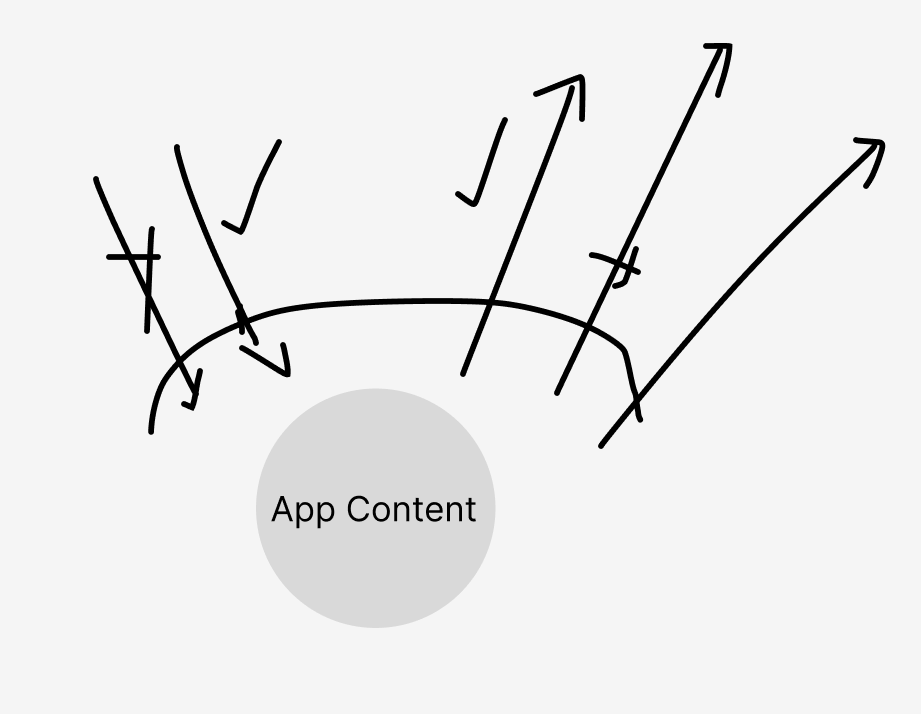

# 👩‍🦽 A-AIE: Accessibility, inclusion & exclusion

> This short module allows people to share anonymously their initial position by answering questions regarding accessibility, before discussing the results collectively.

**⛳️ Section**: A. What is accessibility ?

**👥 Audience**: Everyone

**⏱️ ️Duration**: 20'

**📚 Prerequisites**: A-FNA: Feeling the need for accessibility

**📖 Is a prerequisite to**: None

---

# When to use ?

Use this module to get a nuanced sense of what accessibility, ableism and techno-ableism really means.  

# Description

## 1. What is accessibility

### 1.A Collective Definition of accessibility

Form a circle. The first participant will try to define accessibility. Write their proposition on a whiteboard. Each person must then iterate upon this definition, explaining to everyone the change that they make. 

We then read the collective definition, ask once again if everyone is satisfied with it or if someone want to change something about it. Once it’s settled, we can move to the next part of this module. 

### 1.B Formal definitions of accessibility

If you did the word-cloud of 

[Accessibility, inclusion & exclusion](https://www.notion.so/Accessibility-inclusion-exclusion-2074d182e65380e7b77fefd7bb934b13?pvs=21)

go though the following definitions, trying to find to which one each word is mostly related. 

- From a product design standpoint
    
    According to Wikipedia : 
    
    > **Accessibility** is the design of products, devices, services, vehicles, or environments so as to be usable by [disabled](https://en.wikipedia.org/wiki/Disabled) people.[[1]](https://en.wikipedia.org/wiki/Accessibility#cite_note-1)
     The concept of accessible design and practice of accessible 
    developments ensures both "direct access" (i.e. unassisted) and 
    "indirect access" meaning compatibility with a person's [assistive technology](https://en.wikipedia.org/wiki/Assistive_technology) (for example, computer [screen readers](https://en.wikipedia.org/wiki/Screen_reader)).[[2]](https://en.wikipedia.org/wiki/Accessibility#cite_note-2)
    > 

- From a legal standpoint
    
    In it’s Accessible Canada Act (ACA) the government of Canada while not defining accessibility stated that the primary goal of their accessibility policy was to : 
    
    > The [*Accessible Canada Act* (ACA)](https://laws-lois.justice.gc.ca/eng/acts/A-0.6/)
     came into force in 2019. The overarching goal of the ACA is to realize a
     barrier-free Canada by 2040. The legislation benefits all Canadians, 
    especially persons with disabilities, through the proactive 
    identification, removal and prevention of barriers to accessibility in 7
     priority areas:
    > 
    > - employment
    > - the built environment
    > - information and communication technologies (ICT)
    > - communication other than ICT
    > - the design and delivery of programs and services
    > - the procurement of goods, services and facilities
    > - transportation

- From a software standpoint
    
    In their Agile Accessibility handbook, Dylan Barell state accessibility in software as 
    
    > It basically comes down to three principles:
    > 
    > - Can all your users, with the abilities and senses that they possess, perceive the information your application presents to them? For example, can they “see” the meaning of the little icon button with an image of a pen inside it?
    > - Can your users, with their specific input device or assistive technology, operate all the controls within your application’s user interface? For example, if your application supports the operation of a button through touching the screen, does it also allow that button to be operated through a keyboard and a voice command?
    > - Can your users understand the information and the user interface controls? For example, if the application requires the creation of a password with constraints, are those constraints clearly communicated in a way that allows the user to complete the task without undue difficulty or an unreasonable degree of intellectual skill?

- From a political standpoint
    
    We would define accessibility as
    
    > Trying to fight back against the structural tendency to exclusion of disabled people and attempting to provide them with a place (virtual or not) where they feel at ease and free to express themself.
    > 

Take some time to reflect together onto which definition is the closest to the one you built together. How do participants feel toward all those definitions ?

## 2. Ableism in all it’s forms

### 2.1 What is ableism ?

Ableism would be defined by the Cambridge dictionary as 

> [policies](https://dictionary.cambridge.org/dictionary/english/policy), behaviours, [rules](https://dictionary.cambridge.org/dictionary/english/rule), etc. that [result](https://dictionary.cambridge.org/dictionary/english/result) in [unfair](https://dictionary.cambridge.org/dictionary/english/unfair) or [harmful](https://dictionary.cambridge.org/dictionary/english/harm) [treatment](https://dictionary.cambridge.org/dictionary/english/treatment) of [disabled](https://dictionary.cambridge.org/dictionary/english/disabled) [people](https://dictionary.cambridge.org/dictionary/english/people) (= [people](https://dictionary.cambridge.org/dictionary/english/people) who have an [illness](https://dictionary.cambridge.org/dictionary/english/illness), [injury](https://dictionary.cambridge.org/dictionary/english/injury), or [condition](https://dictionary.cambridge.org/dictionary/english/condition) that makes it [difficult](https://dictionary.cambridge.org/dictionary/english/difficult) for them to do things that most other [people](https://dictionary.cambridge.org/dictionary/english/people) can do) and in a [continued](https://dictionary.cambridge.org/dictionary/english/continued) [unfair](https://dictionary.cambridge.org/dictionary/english/unfair) [advantage](https://dictionary.cambridge.org/dictionary/english/advantage) to [people](https://dictionary.cambridge.org/dictionary/english/people) who are not [disabled](https://dictionary.cambridge.org/dictionary/english/disabled)
> 

Right now, some parts of your apps might only be accessible to those who can only, for example, see and hear. Thinking these senses as the “default” mediums for interacting with apps is *ableist*. It is very important to keep in mind that people who are qualified of “disabled” are in reality simply working with a different set of abilities, which is typically more marginal, yet not inferior. If they can’t access your app, it means that your design is broken - not them.

In our situation, it’s quite obvious that the goal of accessibility is to minimize ableism in the software that we provide. 

### 2.2 What is techno-ableism ?

Techno-ableism is a term defined by Ashley Shew in her book [Against Technoableism Rethinking Who Needs Improvement](https://wwnorton.com/books/9781324036661), a lecture that we truly recommend. 

In the introduction of her book, she state

> I CAME UP WITH the term “technoableism” to describe a pattern disabled people see over and over—and a pattern observed by many others too. Technoableism is a particular type of ableism, one that is highly visible in media and entertainment and omnipresent in the ways most people casually talk about technologies aimed at disability. Technologies for disability can never just be “tools that are useful sometimes,” in the phrasing of Jen Lee Reeves. **Technoableism is a belief in the power of technology that considers the elimination of disability a good thing, something we should strive for.** It’s a classic form of ableism—bias against disabled people, bias in favor of nondisabled ways of life. **Technoableism is the use of technologies to reassert those biases, often under the guise of empowerment.**
> 

Put simply, it’s believing that disabled people need to be fixed by technology. Rather than celebrating the diversity and **di**verging ability of **dis**-abled people, most tech innovation regarding them aim at “fixing” them often leaving them outside of the discussion about their needs. 

> Sometimes technology is seen as redeeming our lives: nondisabled people believe—and expect us to believe—that technology will “solve” the problem of our disability and save us, or those like us, in the future. Yet these expectations often don’t match our circumstances. They confine us. When people assume that one device will “fix” us, they don’t pay attention to the host of other concerns around disability technology—the bad planning and design, the need for constant ongoing maintenance, the problem of money […], and the staggering lack of social support for disability accommodations […]. These are all forms of ableism.
> 

Software plays a huge role in today’s daily life and communication. It can be a huge lever of exclusion and inclusion. Therefore, it’s our duty as developers to try and lean toward the later without falling into the trap of thinking we are saving or fixing anything else than our apps. 

Some article titles documented by Ashley Shew give us a great exemple of the ableist “hero-syndrom” that can occur in the tech industry. 

> “THE TECH GIVING PEOPLE POWER TO DEAL WITH DISABILITY” —BBC NEWS“HOW TECHNOLOGY WILL CHANGE THE LIVES OF PEOPLE WITH DISABILITIES” —FORBES“FIRST PROSTHETIC LIMB DESIGNED FOR WOMEN: ‘I FEEL LIBERATED’” —BBC2“ROBOTIC EXOSKELETONS ARE HERE, AND THEY’RE CHANGING LIVES” —POPSCI
> 

For a more concrete exemple, Ashley Shew showcase how discord became a welcoming place for many autistic people. 

> Awni mentioned Discord as a social platform “easily adapted by autistic users to facilitate autistic-styled communication due to its flexibility both with custom emotes and for purpose-centric server organization.” Gardiner pointed to the importance of letting autistic people lead tech conversations with what they want and how they want to do things. This doesn’t mean jumping in to teach autistic people to play games in the way allistic people do but rather letting the “nothing about us without us” lesson of the disability rights movement carry into this space: to learn from autistic people how to use spaces autistically.
> 

Understanding those concepts are crucial to avoid very common misguided behaviors. But now, we need to see how today’s organizations and regulation stand regarding them…

# Resources

[Particify – Interactive education](https://www.particify.de/en/)

# Sources

[Wikipedia's definition of Accessibility](https://en.wikipedia.org/wiki/Accessibility)

[About an Accessible Canada](https://www.canada.ca/en/employment-social-development/programs/accessible-canada.html)

[Agile Accessibility Handbook](https://accessibility.deque.com/agile-accessibility-handbook)

[Definition of ableism](https://dictionary.cambridge.org/dictionary/english/ableism)

[Against Technoableism](https://wwnorton.com/books/9781324036661)