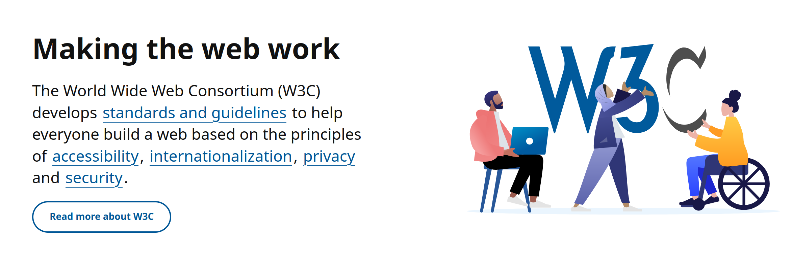

# 🗺️ A-BCT Brief cartography of today’s accessibility landscape

!!! Info "In this module"
    We will cover the main actors of todays accessibility landscape as well as their dynamics.

**⛳️ Section**: A. What is accessibility ?

**👥 Audience**: Everyone

**⏱️ ️Duration**: 10'

**📚 Prerequisites**: [👩‍🦽 A-AIE: Accessibility & Ableism](A-AIE.md)

---

# When to use ?

This module is useful as an introduction to understand what are the current dynamics in the accessibility landscape, what actor to listen to and more importantly which ones are disregarded by most experts.

## Disclaimer

We ourselves, are not experts by any mean, only developers working on accessibility and inclusiveness trying to provide others the resources we wished we had. We don't have a complete understanding of all at stake in the accessibility landscape. Keep in mind that the following cartography will certainly be missing some precisions. If you want to help completing it with your own knowledge, feel free to contact us or to open a pull request on [our repository](https://github.com/Page-and-Maxence/building-inclusive-open-source-software).

# The actors of accessibility

The actors can be separated in four main parts : the publics actors, non-profit collectives, consulting firms and the corporate actors. We could also mention university's researches but this would turn this section into a full bibliography.

## Publics actors

### States

### European union

## Non-profit collectives

### The World Wide Web Consortium (W3C)

The [World Wide Web Consortium](https://www.w3.org/about/) is the organization behind multiple accessibility guidelines and standards recognized worldwide. With over 30 years of existence It's mostly known for it's work on the WCAG which are the worldwide standards in term of web accessibility.

They also created and updated a very extensive documentation on how to meet those standards with their [How to Meet WCAG (Quick Reference)](https://www.w3.org/WAI/WCAG22/quickref/). They are definitely one of the most important organization providing resources on accessibility.

**They have full time employees but also rely on volunteers contributions, so if you want to help them, [go ahead](https://www.w3.org/get-involved/)!**

Sadly, despite the amazing work that they do on accessibility, they still lack diversity. They are trying to do better on this topic, providing [yearly details statistics of their diversity](https://www.w3.org/about/diversity/diversity-report-2024/) for their Advisory board, technical architecture group, board of directors and management. We can notice that their inclusiveness seems to improve over time.

### Appt Foundation

### The A11Y Project

### The accessibility book club

## Consulting firms

### Deque

## Corporate actors

### Apple

### Microsoft

### Orange

# What to avoid

## Accessibility and AI powered tools

