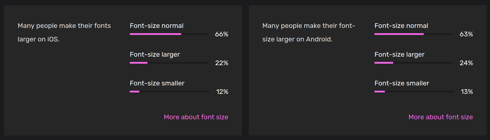

# 🤺 B-DSU: Developer stance & user collaboration

!!! Info "In this module"
    When creating, finding the right stance can be perilous;
        - How to help without infantilizing?
        - How to care without assuming one's needs?
        - How to design for something we don't experience?

    This module aims at finding answers to those questions from a software perspective.

**⛳️ Section**: B. From accessibility to inclusiveness

**👥 Audience**: Everyone

**⏱️ ️Duration**: 10'

**📚 Prerequisites**: None

---

# When to use?

This module tries to provide the trainees with a reflection on what one's perspective on the world is and how to attempt to account for other's ones.

# Description

## Who are you?

Who are we as people? We all have a singular, partial perspective of the world. These comes with biases but also insights and experiences. Opening up to different views is always a tough process. In [Developing Inclusive Mobile Apps](https://link.springer.com/book/10.1007/978-1-4842-5814-9), Rob Whitaker gives an exercise to identify our biases. The following workshop is a variation adapted from theirs.

Provide a piece of paper to all of the trainees attempting the training. Ask them to make a list of five person the 5 peoples they trust the most, people they would go to for advices (no matter whether they are colleagues, family or friends). Once that's done, ask them to count a point each time the answer to the following questions is yes.

1. Are all of them of the same ethnicity as you?
2. Do all of them have the same sexual orientation?
3. Do all of them have the same nationality as you?
4. Are all of them considered able-bodied?
5. Do all of them have a diploma (or, are pursuing one)?
6. Are all of them cisgender?
7. Are all of them working/studying or being retired?
8. Are all of them from the same or higher economic background as you?
9. Are most of them men?
10. Do they all speak the language of the country they live in?

---

Once that's done, count from 1 up to 10 and ask the trainees to raise their hand on the number corresponding with their score. Precise this part of the workshop is entirely optional. To ease of trainees you can also raise your hand on the number corresponding to your own results. This should help the group to start reflecting on their own biases. Note that you can adapt those questions to fit the cultural environment in which you give this formation.

## Who is disabled?

Who exactly is disabled is a question with no evident answer. According to the [2024 study](https://appt.org/en/stats) of the [APPT foundation](https://appt.org/en/about), a non profit based in the Netherlands, 61% of Dutch Android users and 45% of Dutch iOS users have one or more accessibility settings activated on their phone. A quarter of the Android user they surveyed used two or more accessibility features.

Source: [APPT Foundation, Accessibility Statistics 2024](https://appt.org/en/stats)

Disability is not something easy to categorize. A lot of disabilities are not visible, some develop over time, other have varying effects that make them hard to apprehend. A lot of people, thinking of themselves as able-bodied will use a bigger font on their phone. The frontiers between someone without any disability who has glasses and someone with low vision is very hard to establish. As stated in the book [Developing Inclusive Mobile Apps](https://link.springer.com/book/10.1007/978-1-4842-5814-9), by Rob Whitaker:

!!! Quote "Rob Whitaker, *[Developing Inclusive Mobile Apps](https://link.springer.com/book/10.1007/978-1-4842-5814-9)*"
    Disability is not a binary state. We all have "abilities and limits to those abilities. Disability happens when we have built something that doesn’t work for someone with particular skills.

**In fact, it could even not be desirable to draw this line.** Ashley Shew states in [Against Technoableism: rethinking who needs improvement](https://wwnorton.com/books/9781324036661):

!!! Quote "Ashley Shew, *[Against Technoableism, Rethinking Who Needs Improvement](https://wwnorton.com/books/9781324036661)*"
    Today, many of our ideas about able-bodiedness and disability come from classifications based on who is suitable for plantation or factory work: we call people “disabled” when they can’t perform “normal” amounts of physical labor. [...] Disability has not always been as deeply tied to the ability to do labor as it is now. As Kim Nielsen’s A Disability History of the United States shows, many Native American cultures had more room for variation and a different sense of health and wellness; disability was (and is) not stigmatized in the same ways among some Native American groups **(and, incidentally, many Native languages have no word for “disability” as a category). Nielsen explains how Plains Indian Sign Language (the most well documented of Native sign languages), for instance, was used by various Plains tribes as a common language of trade—so signed language was a natural part of culture and language such that communication norms allowed more easily and naturally for deaf inclusion.

Depending of the circumstances, we are all disabled and we will all be. As stated previously, disability is plural, a shallow category that shouldn't negate intersectional thinking.

## Who do you want to be?

### Disability experts and disabled experts
In [Against Technoableism: rethinking who needs improvement](https://wwnorton.com/books/9781324036661), Ashley Shew also writes extensively about expertise on accessibility. While disabled experts are often not taken seriously, some of their able-bodied peers consider themselves experts at understanding one's needs. She states:

!!! Quote "Ashley Shew, *[Against Technoableism, Rethinking Who Needs Improvement](https://wwnorton.com/books/9781324036661)*"
    Throughout, I consider disabled people the experts about disability. I’m no longer interested in what so-called experts (nondisabled scientists, physicians, therapists, and so on) have to say. These narratives are already overrepresented, and in some cases, they have done damage to disabled people as a community, disabled people as knowers, and the experience of disability as valid and valuable. When we don’t listen to those with actual experience, we often get accounts of disability and technology completely wrong. Disabled people are “the real experts” (the title of Michelle Sutton’s 2015 edited volume about and authored by autistic people) when it comes to technology and disability. We use technologies. We also reject them, grapple with them, or repurpose them. The views on technology we get from listening to disabled people often look very different from those of people educated in the medical and “helping” professions.

We cannot replace the perspectives of people with disabilities simply by reading about them or running a series of automated tests. We highly encourage recruiting people from diverse backgrounds in your team. The whole project will benefit from varying perspectives and it could help to leverage against systemic exclusion and hiring discriminations which affect minorities. In fact, [a study from the Chartered Institute for IT](https://www.bcs.org/articles-opinion-and-research/nearly-90-000-disabled-people-are-missing-from-tech-industry-says-professional-body/) states that in the UK alone, "Nearly 90,000 disabled people are 'missing' from tech industry".

**But your working environment will never be representative of the whole world and every user.** As quoted from [Developing Inclusive Mobile Apps](https://link.springer.com/book/10.1007/978-1-4842-5814-9) in [🔭 B-INO Inclusive needs overview](B-INO.md):

!!! Quote "Ashley Shew, *[Against Technoableism, Rethinking Who Needs Improvement](https://wwnorton.com/books/9781324036661)*"
    “Employing the word “users” can result in falling into the trap of thinking of users as one group – an amalgamation of people who are out there somewhere in the world using your app, a group of people that you’ll never meet and never know. This form of “group think” leads to creating a “one-size-fits-all” solution that, like everything claiming to be “one size fits all,” in reality fits no one.”

### Embracing diversity

**As we need to embrace diversity, it is crucial to fight a natural urge of all software creators: the will to personally find, design, and implement the solution to every problem. There is no one solution, and if there were, you would probably not be the one to find it. Your role as a software builder is to reach out to the real accessibility experts: those who rely on accessibility and experience its flaws every day, i.e. people with disabilities. Therefore, rather than trying to produce a "perfectly accessible" and inclusive product, we would rather suggest to try and make the main features as inclusive as possible and then get feedback from diverse users on what are their main issues with your software are.**

It's likely that your anticipation of their needs will not match their experience. Maybe you've spent hours making a video calling feature accessible for low vision users when they mostly struggled with the button for sending messages not being labeled as such, a fix that would have taken you a few minutes. Let them, the real experts, guide your priorities. Nothing about them without them.

This does not mean your role in the feedback process is passive. Providing the space for people to give feedback is the cornerstone of that process. Consider setting up a dedicated form, type of issue, or even email for these topics. Even if it is already technically possible to share those issues via your current channels, creating a specific one show your intention of treating and valuing them.

This does not mean either that your expertise is useless if you are not experiencing the discriminations for which you are assessing your products. As you know the product you are building and what experience you are aiming for, you - as a product engineer, designer, or even developer - will be necessary to understanding what can be enhanced. For example, users with low vision or who are blind cannot give feedback on elements of the interface they ignore. If an element is not reachable, they may not be able to tell you that it's not accessible, as they have no way of knowing its existence. The best way of tackling those issues is by directly looking at them using the application. It's only at the intersection of your two expertise that an understanding of what goes wrong can emerge. And this is why we recommend testing next to the user which is the best way to understand how your product is being used! This will avoid you getting some feedback like: "sometimes when creating an account, my screen reader stops working" - an unclear issue which is yet the best that can be given to you.

# Sources

[Whitaker Rob. *Developing Inclusive Mobile Apps, Building Accessible Apps for iOS and Android*, 2020.](https://link.springer.com/book/10.1007/978-1-4842-5814-9)

[Shew Ashley, *Against Technoableism: rethinking who needs improvement*. 2023](https://wwnorton.com/books/9781324036661)

[The Chartered Institute for IT, *Nearly 90,000 disabled people are 'missing' from tech industry, says professional body*. 2024](https://www.bcs.org/articles-opinion-and-research/nearly-90-000-disabled-people-are-missing-from-tech-industry-says-professional-body/)

