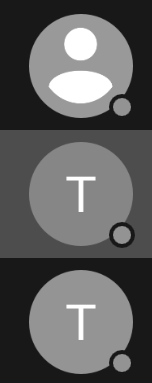
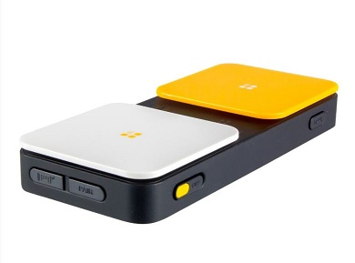

# 🔭 Inclusive needs overview

!!! Info "In this module"
    This module aims at giving the trainees an overview of the most common accessibility needs their users could have.

**⛳️ Section**: B. From accessibility to inclusiveness

**👥 Audience**: Everyone

**⏱️ ️Duration**: 15'

**📚 Prerequisites**:

---

## When to use

This module should be used once the trainees have a basic understanding of what accessibility means. It shows the trainees more concrete examples of accessibility and inclusiveness challenges.

## Main disabilities to account for in software

Below are the main disabilities you will need to directly take into account when building software. Keep in mind that disability is not a binary state but rather refers to a wide variety of living experiences, and that a lot of users experience multiple disabilities at once. Consequently, this list should not be seen as exhaustive.

### Low vision and blindness

Visual impairment affects up to 17% of users, [according to Microsoft](https://learn.microsoft.com/en-us/windows/win32/uxguide/inter-accessibility). These visual impairments range from low-vision to blindness. Therefore, it is crucial that your application meets legibility standards regarding font sizes (which should be adjustable at least from the system settings) and contrasts, and also supports assistive technologies like screen-readers or braille displays (requiring keyboard support for desktop apps).

Here is an example of navigation between elements navigated using a cursor-based assistive technology, like a screen reader.

<figure markdown="span">
    
</figure>

Fortunately, because of the way OSes and assistive technologies function, making an app accessible to screen readers should make it mostly accessible to others. While supporting screen readers will likely represent an important investment, the impacts of this work are very rewarding.

### Hearing impairments

18% of users are hearing-impaired [according to Microsoft](https://learn.microsoft.com/en-us/windows/win32/uxguide/inter-accessibility). For more specific information on their needs, you can check the [How to Meet WCAG (Quick Reference)](https://www.w3.org/WAI/WCAG22/quickref/#time-based-media) of the W3C. You will mostly need to provide redundant access to all auditive information. This can be for example a visual notification accompanying a sound, or real-time subtitling like the [Whisper Transcript plugin for Jami](https://jami.net/plugins/).

### Motion sickness

Some users will experience motion sickness when exposed to animations or visual effects. You should be aware of that, providing them with solutions for a less triggering experience. Known triggers include:

- Zooms
- Flashing or blinking
- Animations playing automatically without user interaction
- Parallax effects

Common solutions include buttons to pause animations, using OSes APIs to detect if reduced motion is enabled, limiting flashing elements when possible, etc.

### Color blindness

Can you guess what is the accessibility issue in this screenshot?

<figure markdown="span">
    
</figure>

Some colorblind users would not have any way of identifying the presence status of the user as it's only communicated through a colored dot.

Color blindness is typically less thought of. Making your UI accessible to people who experience this disability is straightforward: **make sure your UI doesn't rely on color elements alone to convey information**. For example, if a colored dot indicates whether a user is connected or not, it should be accompanied by a textual label or an icon.

### Cognitive impairments

Cognitive impairments affect [16% of users](https://learn.microsoft.com/en-us/windows/win32/uxguide/inter-accessibility). Consequently, it is crucial for designers to take these into account. Accessibility can be improved for this demographic by allowing for highly customizable applications and UIs, allowing for simplification, hiding of some elements, etc, so that users can have the app tailored to their specific needs.

In [👩‍🦽 Accessibility & Ableism](A-AIE.md) we saw a quote of Ashley Shew showcasing how Discord became a welcoming place for many autistic people.

!!! Quote "Ashley Shew, *[Against Technoableism, Rethinking Who Needs Improvement](https://wwnorton.com/books/9781324036661)*"
    Awni mentioned Discord as a social platform “easily adapted by autistic users to facilitate autistic-styled communication due to its flexibility both with custom emotes and for purpose-centric server organization.” Gardiner pointed to the importance of letting autistic people lead tech conversations with what they want and how they want to do things. This doesn’t mean jumping in to teach autistic people to play games in the way allistic people do but rather letting the “nothing about us without us” lesson of the disability rights movement carry into this space: to learn from autistic people how to use spaces autistically.

### Motor disabilities

Affecting up to [19% of users](https://learn.microsoft.com/en-us/windows/win32/uxguide/inter-accessibility), many people can have difficulties using a phone, a keyboard or a mouse. They often have alternative input devices like switches or audio controlling. You must take them into account when designing your user experience (UX).

<figure markdown="span">
  { width="300" }
  <figcaption>Accessibility switch</figcaption>
</figure>

### Speech or language

Speech or language-related disabilities can take various forms ranging from dyslexia, illiteracy or elocution difficulties. Some of the solutions will include speech-to-text features, support for custom typefaces like [Open Dyslexic](https://opendyslexic.org/) and spell-checkers.

## Additional needs and factors to take into consideration

In the [🎨 Inclusive design 101](C-IDE.md) module we will develop further the intersectional needs to take into account. Before that, here is a *non-exhaustive* list of human characteristics to keep in mind in order to try and include as many user as possible:

- Age
- Culture
- Digital literacy
- Education
- Ethnicity
- Gender, gender identity
- Historical context
- Language
- Mental health
- Nationality
- Physical *and* cognitive (dis)abilities
- Sexuality
- Socio-economic context

!!! tip
    **You need to consider the intersections of all of those categories as well as the disabilities listed previously in the first section of this module.**

Realistically, you cannot predict and account perfectly for all of those characteristics, because they are spectrums rather than fixed labels. The best you can do, is actively seek and listen to feedback from diverse user groups, and make sure your team is as diverse as possible.

Some of the tools that we will share later in this training should still help you go through the main accessibility and inclusiveness elements when designing and developing.

## Sources

[Microsoft, *Accessibility (Design basics)*](https://learn.microsoft.com/en-us/windows/win32/uxguide/inter-accessibility)

[W3C, *How to Meet WCAG (Quick Reference)*](https://www.w3.org/WAI/WCAG22/quickref/#time-based-media)