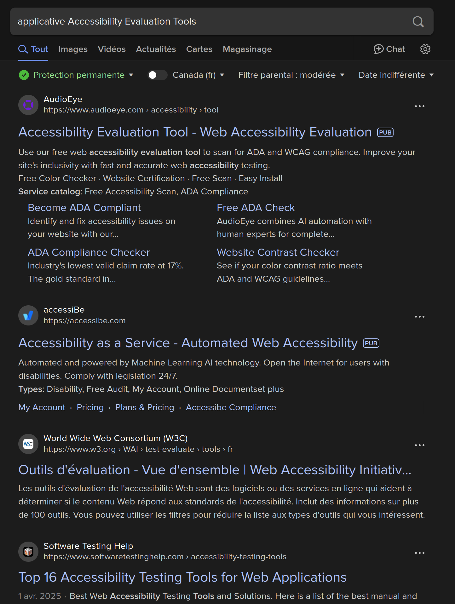
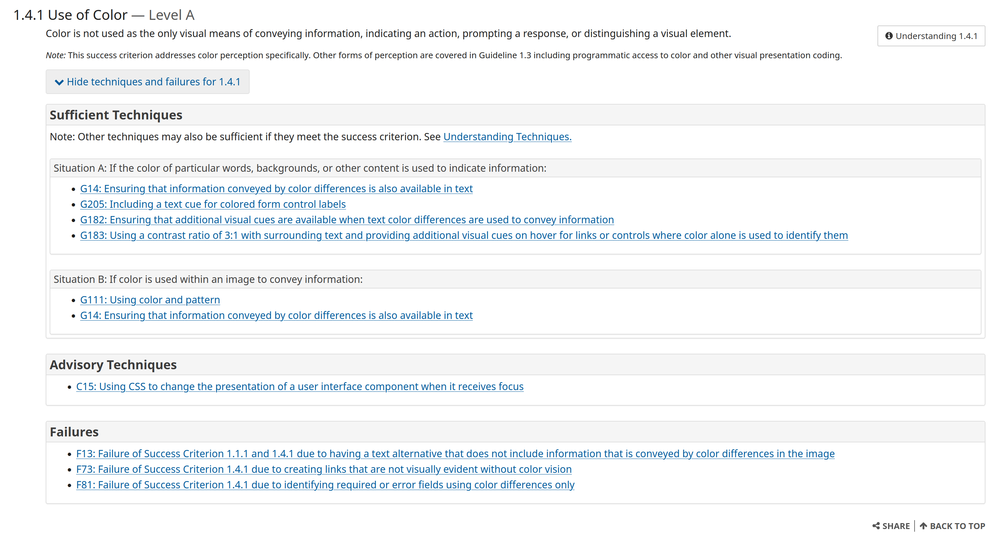
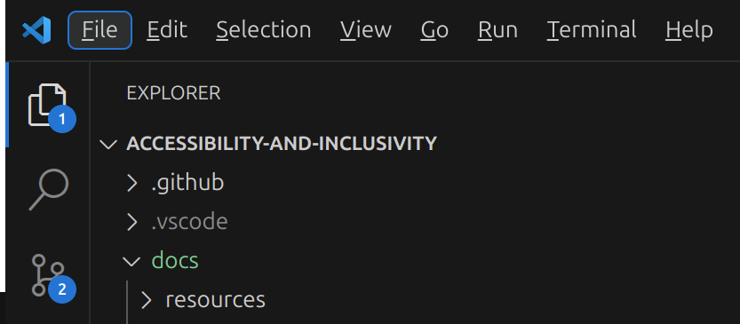

# 🖥️ C-IDD Inclusive design for Desktop

!!! Info "In this module"
    This module contains the basics of accessible and inclusive design for Desktop.

**⛳️ Section**: C. Designing inclusive and accessible software

**👥 Audience**: Designers

**⏱️ ️Duration**: 15'

**📚 Prerequisites**: [🎨 C-IDE: Inclusive design 101](C-IDE.md), [🔧 A-ITD Inclusiveness technologies : Desktop](A-ITD.md)

---

## When to use ?

Use this module right after reading [🎨 C-IDE: Inclusive design 101](C-IDE.md) if you're designing applications for Desktop. It will give you insights on how to adapt those generic principles to your platform.

## What are the resources ?

### ...And why are there so few of them ?

Searching the web for resources on applicative desktop accessibility and inclusiveness guidelines will probably left you unsatisfied and confused as you will liked be overwhelmed by resources and testing tools for web accessibility and none for Desktop applications.

    

This phenomenon is not limited to the first internet search, there is a flagrant lack of accessibility resources for desktop applicative design and development. Indeed, this is one of our motivations for the creation of this training. While on mobile, most of the accessibility features are native to the OS, and therefore documented, desktop accessibility relies much more on third party tools and framework-specific implementation.

This lack of resources while due to multiple factors can largely be attributed to a simple reason: the number of people who need to create and deploy a website is so enormous that it is a completely different scale than the number of persons that need to develop a native desktop application. This has been further accentuated by the rise of web-based native frameworks like [Electron](https://www.electronjs.org/).

Therefore, the few resources publicly available on desktop applicative accessibility are often made by the operating system maintainers themselves. You can find the [Accessibility overview of Microsoft for Windows](https://learn.microsoft.com/en-us/windows/apps/design/accessibility/accessibility-overview#main), the [one for Apple platforms](https://developer.apple.com/accessibility/) or [a list of accessibility tools for Linux](https://web.archive.org/web/20040715033825/http://lars.atrc.utoronto.ca/current.html). Those greatly vary in quality and usually doesn't go much deeper than "disabled users should be able to use your app", listing disabilities and features without guidance on how to implement for them.

How to deal with contextual elements, different panes, complex UI elements that you typically don't find on a web page ? Those questions often remain unanswered. We don't have answers to all of those. Working on applicative accessibility is not memorizing a fix set of rules to apply but rather learning how to find relevant solutions to problems you encounter. Therefore this module should provide you with the tools and information needed to resolve the issues that you will encounter.

### The WCAG standard

A useful resource to help you design accessibility for your Desktop app is one that isn't made for applications: [The Web Content Accessibility Guidelines](https://www.w3.org/WAI/standards-guidelines/wcag/) (WCAG). It aims at providing shared worldwide accessibility guidelines for web content. It's therefore really extensive.

While some of its content doesn't apply directly to native applicative design (for example aria labels are only a web concept), there is still a lot that we can learn from the WCAG. We especially recommend to use the [*How to Meet WCAG (Quick Reference)*](https://www.w3.org/WAI/WCAG22/quickref/) from the Web Accessibility Initiative. It provides you with examples of successful and unsuccessful designs for every WCAG guideline and is sorted by topic. For example, you can simply navigate to the "1.4.1 Use of color section" and see the list of guidelines related to this point.

You can then check the techniques and failures for this point as well as well documented solutions for each of them. Here is one of the examples given for use of color.

[![A screenshot of an accessibility failure for use of color stating "A bar chart of sales data is provided as an image. The chart includes yearly sales figures for four employees in the Sales Department. The text alternative for the image says, "The following bar chart displays the yearly sales figures for the Sales Department. Mary sold 3.1 Million; Fred, 2.6 Million; Bob, 2.2 Million; and Andrew, 3.4 Million. The red bars indicate sales that were below the yearly quota". This text alternative fails to provide the information which is conveyed by the color red in the image. The alternative should indicate which people did not meet the sales quota rather than relying on color."](resources/c-designing-inclusive-and-accessible-software/wcagTechnique.png)](https://www.w3.org/WAI/WCAG21/Techniques/general/G14)

## Designing for keyboard usage

Keyboard usage is a key aspect of designing for Desktop applications. A lot of users don't use a mouse for various reasons. While for some of them, this is a preference, you should keep in mind that most vision-impaired users will not use a mouse as it can be very unreliable without a visual indicator (try using your mouse with an invisible cursor to get a sense of what it would feel like).

### Keyboard navigation (what each key should do)

Keyboard navigation can be a bit tricky. Most resources you can find on accessibility only tell you that elements should be usable with a keyboard but not what combination of keys is intuitive to navigate it. In reality there are five main types of keyboard inputs. Implementing those inputs properly will make your application usable with a keyboard.

#### Tab & Backtab

The Tab and Backtab (Shift+Tab) keys are the main ways of navigating trough the UI. Pressing it should respectively send the focus to the next and previous focusable elements of the UI. It should not be used to navigate trough the elements of a list or focused static text. The static text should still be accessible in the label of an associated element.

#### The arrow keys

The up and down arrow keys are used to navigate inside an element. For example, while pressing tab would focus and then exit a list, the arrows should be used to navigate inside of the said list.

#### Enter

The enter key is quite straightforward. It should act as if you were clicking on an element. In some contexts it can be used to close informative popups as an alternative to the escape key.

#### Escape

The escape key is supposed to close popups and dropdowns. Having it broken is a common problem in many applications. This is what we call a "focus trap"; when an element takes focus without any way for a keyboard user to make it release it. Having the escape key working properly is absolutely necessary to making your application keyboard-accessible.

#### Alt

The alt key has two main purposes. Firstly it should close and escape fields where tab inputs would be absorbed (some text inputs for example). Secondly it should focus the menu attached to the top of an application. Here is an example in VSCode.

### Shortcuts

Your application is now usable with a keyboard, but you shouldn't be content with usability. You should be designing you app to be fun and fluid, not just "usable". Keyboard shortcuts are the key to achieving that. They make it unnecessary to circle though all the elements with Tab inputs. Indeed, someone used to the shortcuts of an application can operate it much faster than one with a mouse.

Here you can see an example of the keyboard shortcuts usable during a call in [Jami](https://jami.net/).

## Resources

[Web Accessibility Initiative. *How to Meet WCAG (Quick Reference)*](https://www.w3.org/WAI/WCAG22/quickref/)

## Sources

[Microsoft. *Accessibility overview for Windows*](https://learn.microsoft.com/en-us/windows/apps/design/accessibility/accessibility-overview#main)

[Apple. *Developing accessible apps*](https://developer.apple.com/accessibility/)

[JP Schnapper-Casteras & Janet Hopkins. *Current Work on Linux Accessibility*, 2004](https://web.archive.org/web/20040715033825/http://lars.atrc.utoronto.ca/current.html)