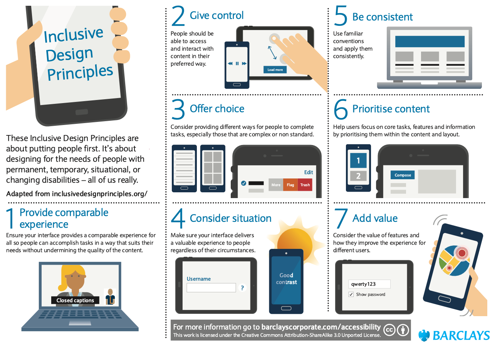
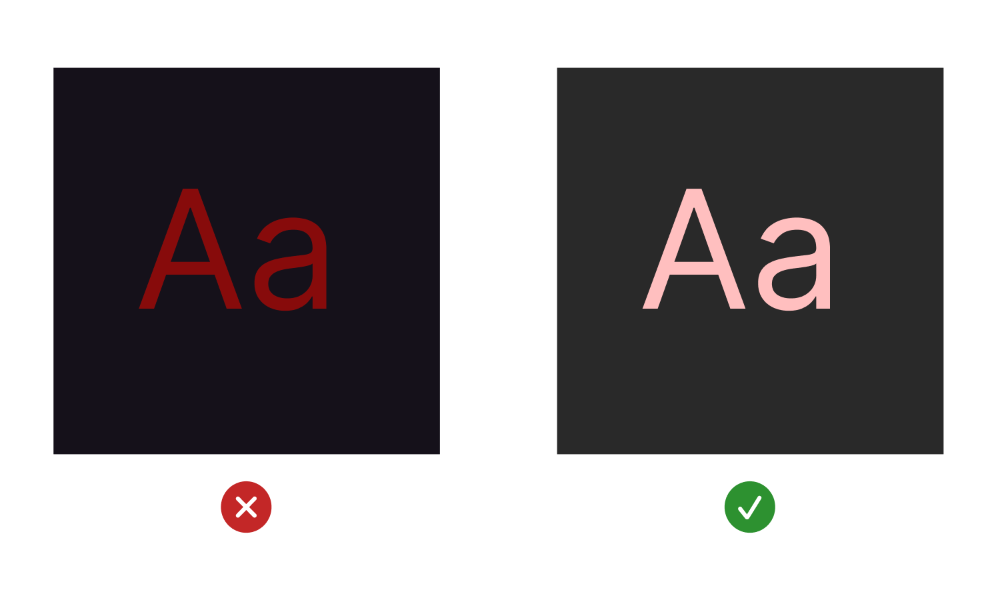
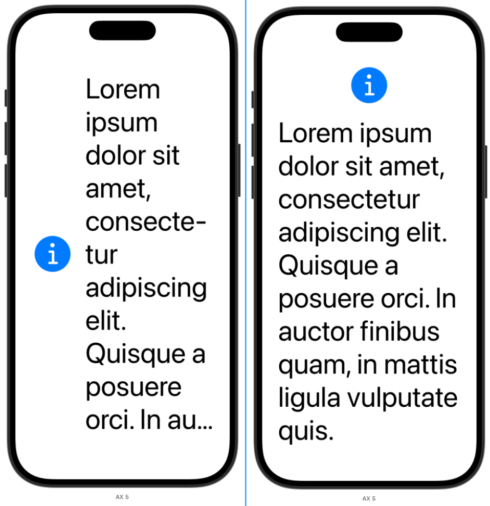
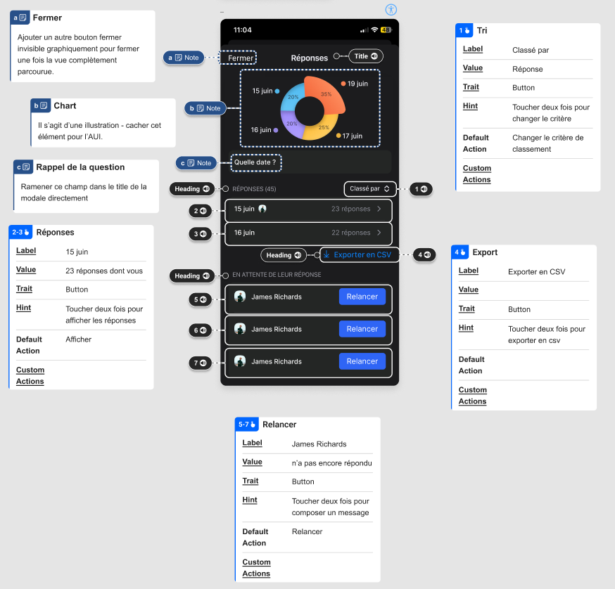
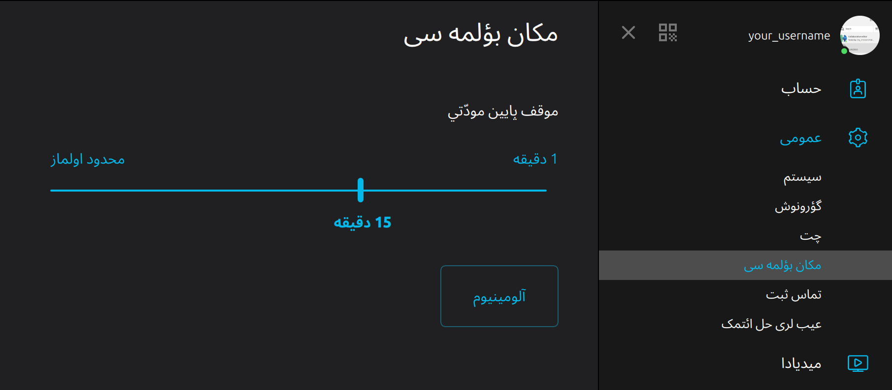

# 🎨 Inclusive design 101

!!! Info "In this module"
    This module aims at giving accessibility and inclusiveness essentials for app
    design.

**⛳️ Section**: *C. Designing inclusive and accessible software*

**👥 Audience**: Designers

**⏱️ ️Duration**: 30'

**📚 Prerequisites**: [🫂 We are all disabled and unique](B-WDU.md)

---

## When to use?

This module should be used with trainees who are in position of making design decisions for the product they are working on. It is mostly intended for product designers and managers, but it is relevant in some scenarios to also include developers, especially for smaller teams.

## What is an inclusive app?

Using the [Cambridge dictionary's definition](https://dictionary.cambridge.org/dictionary/english/inclusiveness), we defined inclusiveness as **the quality of including many different types of people and treating them all fairly and equally**. From there, we have to ask ourselves: what is an inclusive app?

Put simply, we can define an inclusive application as one that can not only be used completely, comfortably and safely by all users, but also in which they can all thrive, feel welcome and express themselves.

It is thus crucial for designers and product leads to always keep in mind that the features, contents and interfaces they design won’t be seen, understood, felt or interacted the same by users, depending on the plural and dynamic human characteristics that structure their representations and interactions with their environment.

Making an inclusive app is thus taking care of everyone, including minorities.

For every feature, every interface, every content that you are building, always ask yourself: is this element inclusive? Are there human characteristics that could prevent a user from understanding, interacting, or even feeling well with the provided content?

As seen in [🔭 Inclusiveness needs overview](B-INO.md), here is a *non-exhaustive* list of human characteristics to keep in mind in order to include as many people as possible:

- Age
- Culture
- Digital literacy
- Education
- Ethnicity
- Gender, gender identity
- Historical context
- Language
- Mental health
- Nationality
- Physical *and* cognitive (dis)abilities
- Sexuality
- Socio-economic context

Though these categories can be useful to get an idea of common characteristics often leading to discrimination, we should not see them as a checklist of requirements to be accessible.

Moreover, human experiences are complex and evolving as they always emerge from intersections of those characteristics.

Consequently, building an inclusive app is all about staying up to date and *actively* open to feedback, knowing that we can never reach *perfect* inclusiveness while doing our best to get there.

## Designing *for* inclusiveness

While implementation plays an important role in the inclusiveness, and especially the accessibility of applications, the designers and product leads hold an important responsibility in the process of building an experience that will resonate and be welcoming to the widest range of users possible.

Product design documents, including specifications, user stories and prototypes act as the team’s compass for delivering awesome products. That is why having inclusiveness in mind from the design is absolutely essential. You don’t ever have to “make this feature accessible” if it is built from the ground up with inclusiveness in mind.

You can see on this picture a bridge that, at first, might seem ordinary. Can you guess what’s wrong with it? In [*Do artifacts have politics?*](https://faculty.cc.gatech.edu/~beki/cs4001/Winner.pdf), Langdon Winner explains that those bridges on Long Island were built low, so that buses were too high to pass them. Therefore, people who did not have a car - the least wealthy, and especially African-Americans - were denied access to the parkway to the public beaches. A technical segregation.

And the same goes with software: if a messaging app denies access to some features to groups of users, it excludes them by preventing them to connect.

Designers can have a great impact on the inclusiveness of their product. By keeping in mind that their design choices always impact someone somewhere, and likely whole communities - or intersection of them - it is possible to shape tools that strive to respect and acknowledge diversity, which is as the core of humanity and **empathetic design**.

## What is an Inclusive User Interface (IUI)?

An important part of making an app inclusive is to make the UI as accessible to the widest range of people as possible.

As we said earlier, we ideally don’t “make an interface accessible”. Rather, we design interfaces to be accessible, so that they support as many ways as possible of interacting with your app.

Alternative, underlying UIs that are built for “disabled” people are often referred to as Accessible User Interfaces (AUI), sometimes as accessibility tree. At first, this concept seems very useful, because thinking of accessibility this way pushes us to make intended and meaningful design choices for how our apps should be accessed using various assistive technologies, font sizes, settings, *etc*, and to think of accessibility with a wider approach than just adding labels to buttons. It’s about designing a whole new UI - an AUI, separate from the one most users will use.

That said, from our perspective, thinking UI and AUI as two distinct interfaces does not make sense, because:

- Most users never access an app using only the UI or the AUI. For example, someone who can see but cannot touch the screen might use a switch as input but still use the visual interface to perceive the content. Moreover, many people considering themselves as “able-bodied” still use some accessibility features on their devices - like custom font sizes or accessibility gestures used by power users.
- As seen in We are all disabled and unique: accessibility, plurality and intersectionality, thinking of users as people working with various sets of abilities rather than belonging to one of the “disabled” or “able-bodied” categories better reflects the wide range of experiences you are inevitably creating when building your app.
- AUI as a concept completely forgets inclusiveness and intersectionality, as it draws a strict line between the “able-bodied” and the “disabled”.
- AUI can also create a pitfall, pushing developers to create the UI first, and then deriving an AUI from it, which makes the concept unhelpful.

We thus prefer to think an inclusive user interface (IUI) as a whole UI that maximizes the different ways it can be interacted with, in order to allow the greatest variety of particular experiences and to satisfy as many needs as possible.

<figure markdown="span">
   { width=700 }
</figure>

From a designer’s perspective, this means your interface should embed a wide set of equal ways of interacting with your app.

In [his book](https://doi.org/10.1007/978-1-4842-5814-9), Rob Whitaker cites The Paciello Group who "helped define the seven principals of inclusive design" which you can find a very valuable detailed explanations and examples [here](https://inclusivedesignprinciples.info/). From that same website, here is a short definition of each principle:

- **Provide comparable experience**: Ensure your interface provides a comparable experience for all so people can accomplish tasks in a way that suits their needs without undermining the quality of the content.
- **Consider situation**: People use your interface in different situations. Make sure your interface delivers a valuable experience to people regardless of their circumstances.
- **Be consistent**: Use familiar conventions and apply them consistently.
- **Give control**: Ensure people are in control. People should be able to access and interact with content in their preferred way.
- **Offer choice**: Consider providing different ways for people to complete tasks, especially those that are complex or non standard.
- **Prioritize content**: Help users focus on core tasks, features, and information by prioritizing them within the content and layout.

## Designing an IUI

Now, how do you concretely make an IUI?

It is important to know that there is no *unique* way of designing inclusive interfaces, and that it is a slow and continuous work, rather than a one-time effort. Inclusiveness recommendations can never be exhaustive.

With that said, here is a non-exhaustive list to start with to make your app more inclusive:

### The colors are contrasted

The most common and easiest to apply advice that is given to designer is to make sure the colors they use are contrasted. This is important not only for people who are colorblind or use a screen filter, but also to guarantee readability on as many screens and conditions as possible. Many tools like [Figma plug-ins](https://www.figma.com/community/plugin/748533339900865323/contrast) or [websites](https://www.figma.com/color-contrast-checker/?background=ffffff&foreground=b50202) can help you check if your colors are well contrasted, or even look for contrast errors in your designs.

<figure markdown="span">
    { width=500 }
</figure>

### The colors are not necessary to understand the UI

Colors are a great way to quickly convey information. Nevertheless, some people can’t or prefer not to rely on colors to identify content. Consequently, informations given by the UI should never only be conveyed through colors. For example, to indicate success of an operation using a green circle is not accessible. Rather, consider using a pictogram that will also be understandable without needing to see colors.

### The layout is responsive to custom font sizes

Some people need or prefer having on their devices custom (typically bigger) font sizes. When applications are not designed or implemented with this adaptability in mind, content can be hidden and the app can become unusable.

There usually is not pre-made answer on how to adapt the UI, but the issue can typically be solved by working on an alternate layout. For example, a common fix for cropped content (especially text) is to conditionally replace de horizontal stacks by vertical stacks, saving horizontal room for the text.

<figure markdown="span">
    { width=600 }
</figure>

A lot of implementation frameworks provide easy ways to set a preferred size for an element, providing adaptation for scaling change.

### The text is naturally justified

Making sure your text is naturally justified (to the left or to the right depending on your language) is important for two reasons:
- Users relying on a magnifier tool to read can miss text that doesn't start on the natural side of the screen.
- Full justification makes it harder read for some people with cognitive disabilities.

### The interactions do not require physical and/or motor abilities

Here are some elements to keep in mind to achieve this milestone:

- **Timeouts** should be avoided as often as possible.
- Providing **shortcuts** (whether they are through keyboard or other accessibility APIs depending on the platform) can make the interface faster and easier to use.
- **Error tolerance** is also very important, as people with tremors have a higher risk of mistapping or misclicking elements. In general, and particularly for destructive actions, asking for confirmation or allowing for cancellation is very important.
- Preventing confidential elements to appear on the screen spontaneously is crucial to **protect the privacy of everyone**, including people whose screen is typically more exposed, particularly wheelchair and phone holder users.
- Eventually, an essential part of making your app inclusive to people with physical motor disabilities is to make the interface nice to use with **assistive technologies** in general, as they often rely on these.

### The content can be accessed using assistive technologies

Designing for assistive technologies can be challenging when you don't know where to start from. In this section, we'll walk through simple steps that will get you started.

**1 - Grouping the elements**

 For people who use screen readers and/or the keyboard to navigate your app, it is crucial to have the information grouped at the right level of granularity.

- If the information is too fragmented, navigating will be slower (as it will need more user inputs) and context might be lost (as the logical link between elements will not be given for people who can’t see the information hierarchy on the screen).
- If the information is grouped at a higher level than it should, navigating to a specific element will be harder and interactions will likely be more complicated due to the fusion of actions.

While it certainly depends on the experience you are building and the platform you are targeting with your design, some good practices to start grouping your elements are:

- Elements that make a contextually atomic group, *i.e.* a group of elements for which we lose context if they are separated, must be grouped.
- Elements that share the same primary action are typically grouped. Elements that have a diverging primary actions should not be grouped, unless you can elect one primary action and demote the other to secondary.
- Each element of a collection view should be a group.

Mobile and desktop navigation are quite different regarding this topic. While mobile apps typically rely technically on “accessibility elements” that can be grouped, desktop apps rely on focusability of specific parts of the interface. From a design perspective, this does not change significantly the way we should think about grouping, but it’s important to keep in mind the implementation can vary drastically, making it important to guide developers and iterate towards the targeted experience.

**2 - Labelling the elements**

Labelling the elements of your app is critical to ensure the understanding of the interface and content. The term “label” can have different implementation meanings depending on the platform or framework used. Here, we will use label to refer to the sentence that is typically read aloud by screen readers, including the type of the content, the value, *etc.* Frameworks and platforms typically use structured data to then generate what we call here a label.

A good label must:

- Reflect the context or type of content you are presenting to the user.
- Tell the actual content (or value) of the element, or its alternative text if it is visual.
- Let the user know if it is actionable.
- Contain all the information a user who can see would have at disposal.
- Be clear and require no more context to be understood.
- Have the informations ordered with care to put the most important elements first, allowing users to navigate through the app rapidly without waiting for the full label to be read out loud if they don’t need to.

For a messaging app, a label for a discussion can be:

     "Michel Berger. 3 unread messages. You said: Thanks ! at 9:07. Message status: sent. Pinned. Actions available.”

Again, depending on the platform or framework, the ways to achieve this might differ. We will tackle this issue in platform-specific modules.

**3 - Establishing a focus order**

<figure markdown="span">
    
</figure>

When your elements are grouped and labelled, the last step to make your interface accessible to people who use assistive technologies and/or the keyboard to use your app is to decide the focus order.

Let’s say we are working on an application implementing a chat. When entering a discussion, which element should be focused first? The last message, the title of the discussion, the text input?

There often is no way of predicting which answer is the best. It really comes down to testing what is the most navigable, understandable and interactable.

In this case, we would typically focus the last element of the discussion first, because it is typically the one of interest, and because it gives a quick access to the text input. But this is clearly a design choice that must be well-thought and tested in the context of your app.

### The UI is simple and intuitive

A simple and intuitive UI benefits everyone. But while this might be a convenience for most users, this is a need for some of them. Wether due to being neurodiverse or to the use of assistive technologies, having an interface that is as simple and less cluttered as possible will instantly make it more accessible and inclusive! [Rob Whitaker gives us in the 12th chapter of his book](https://doi.org/10.1007/978-1-4842-5814-9) some insights on how to achieve this goal, summed up and a bit modified here:

- Keep the interface as less cluttered and as consistent as possible.
- Moving or animated content should be pausable.
- Limit the number of text font and sizes used. Avoid pure black-on-white text.
- Body text should be naturally (not fully) justified.
- Keep written content clear, concise and free of acronyms or idioms.
- Provide alternatives to text (with images, graphs, screen reader support, etc.)
- Limit vivid colors, especially around content.
- “Don’t insist on accuracy for written input. Instead, provide options.” Depending on the platform, implementing auto-completion, spell-checkers, dictation, etc. can be helpful.
- Avoid dark patterns, and moreover, be very clear on the consequences of the action taken by the users on your interface.

### The UI has options to prevent motion sickness

Some people experience motion sickness when looking at animations. Some platforms allow the developers of third party apps to know whether the user as activated a setting reducing motion. It’s a good idea to include an annotation (we will tackle annotations more globally in TODO) letting the developers know when there is a know trigger to be optionally deactivated. As mentioned in [🔭 Inclusiveness needs overview](B-INO.md), known triggers include:

- Zooms
- Flashing or blinking
- Animations playing automatically without user interaction
- Parallax effects

### The UI adapts well to other cultures

A good design should be intuitive to everyone. While it’s difficult to see, our design choices always rely on our cultural background, which is not always shared by all users. There are many subjects to pay attention to while designing in order to make your interface feel as home for as many people possible. While it is impossible to cover everything in this module, here are some of them to start with:

**Language**

Supporting as many languages and dialects as possible makes it possible to many more people to use your app with ease. Organizations open-sourcing their code can consider relying on the community to help give feedback on localization of their apps. Make sure to also open support to dialects.

**Right-to-left support**

Many languages are written from right to left. While most frameworks and platforms provide automatic RTL support, it is important to check that elements of the interface, particularly the custom ones, are rearranged accordingly. Keep in mind that does not only apply to text alignment, but also to navigation, icons, layout, charts, *etc.* We will not detail everything here but you can find [here](https://developer.apple.com/design/human-interface-guidelines/right-to-left) the Apple right to left guidelines that are very detailed.

**Colors**

Depending on the culture, colors can have many different meaning. The most outstanding example is certainly the case of green and red. While in most countries of the western world, green is rather positive and red negative, these colors are generally used to mean the opposite in China.

### User’s age, gender identity, sexuality, ethnicity, financial situation, *etc.* are not assumed

A bias that we can have as humans is to assume others’ characteristics based on what we see around us. And as designers, we want our interfaces to feel welcoming for everyone. This is why paying attention not to assume any human characteristics or stereotype is essential when building an app. Here are some examples:

**Content representing people and activities**

In your app’s content and illustrations, be sure to include different ethnicities, body types, gender expressions, *etc*. when depicting people.

Make sure you also include a good variety of relatable activities and cultural references in textual examples, illustrations, *etc*.

**Gender identity & expression**

- If your app asks for a user’s gender, make sure to provide more options that just male and female, and to add support for custom entries.
- Avoid using the “his” or “her” pronouns when it is not necessary. If your app needs to, be sure to ask users which pronouns they use.
- When depicting a human, use gender-neutral icons rather than a man or a woman.
- If your app requires a legal name, make sure to leave the possibility open to use a preferred name. In general and if possible, it is better not to put any constraint on which name is provided and to allow for a flexible structure to accommodate cultures where names might come in a different order.

**Access to technology**

As Whitaker reports, "[f]or an estimated 20% of Internet users, a smartphone is their only access to the Internet." It is thus crucial to ensure equal access to the features on desktop and mobile not to exclude anyone the experience you are building.

**Digital literacy**

If you are reading this, chance are there are proportionally very few people with as many digital skills as you. That is why it is crucial to keep in mind that your interface should not only be understandable by you or your team, but also (and most importantly) to those who didn't grow up with technology around them. This mainly comes down to making the app simple, intuitive, not cluttered, flexible, and configurable. Some platforms allow for a simplified version of your app, like [Assistive Access on iOS](https://developer.apple.com/videos/play/wwdc2023/10032/).

### The UI takes care of the user

The way your app is designed can have a great impact on the user's mental health. The way content is presented, the reasons for which you push notifications, what you nudge them to do, etc. should be intentional and done empathetically. Allowing for self control and to let go of your app are crucial steps toward this goal.

> Feel free to contribute to this section that could be more detailed!

## Getting creative

*Once the core aspects of your app are accessible and inclusive*, there are many ways in which you can push the experience further while having fun getting creative and innovative. Thinking about new ways of interacting with your app can be a great challenge to tackle with your team. One good example is the "magic tap" on iOS. It allows to execute any action the developer decides when double-tapping with two fingers when VoiceOver is on. It can be used as a shortcut to access a core feature of your app, normally requiring a few more steps to the user. Think about it: what could it do in your app? Another one is the spellchecker which was recently implemented in [Jami](https://jami.net/), allowing people with dyslexia to type more confidently while helping everyone avoiding typos.

## Communicating inclusive design

Communicating your IUI - and especially the accessibility parts which can be graphically invisible - to developers is not an easy task. As most developers are used to receiving designs that they implement based on their experience of what using an app is like, you will likely not get a good result if your communication is not clear.

The best way to communicate the UX you are aiming for users who use assistive technologies is through design annotations, so that you - as a designer - get to think about the labels, focus order, etc. before the implementation starts. We detail how to do so in the platform-specific modules.

Another key to achieving your inclusiveness goals for your UI is to actively test and provide feedback using assistive technologies. Accompanying developers towards a great (inclusive) UX takes time and will likely require many iterations - not to mention that your designs will never be perfectly inclusive either!

## Activity: designing and IUI on a whiteboard

By groups, trainees are invited to design a simple interface (with pen and paper or any design tool they like) that aims at being as inclusive as possible.

On possibility is to ask for an account creation screen for a social media app. The platform should differ from one group to the other to allow for multiple perspectives on UI design.

- The interface should include:
    - Fields to fill in social media information (like name, gender, hobbies, *etc.*)
    - A button to send the form
    - A way of going back to the home page
    - A checkbox to accept the service’s TOS, with a link to access them

The trainer can encourage the groups to think of the ways they can use creatively what they’ve just learned, without feeling the need to implement everything: inclusion is a journey, not an issue to be tackled in ten minutes anyway!

The IUI created by the trainees should be used as a way of addressing common issues like:

- What element should be grouped together? -> Those that don't make sense alone.
- Should the back button be the last or the first element in focus order? -> On mobile the first, on desktop the last.
- What should be selectable -> On mobile, every element containing information, on desktop every interactive element.

## Wrapping up

Here are the key takeaways of this module:

- An inclusive app is one using which users can thrive with and feel welcome in.
- Designers have a big responsibility regarding inclusiveness as they are their team’s compass towards delivering an outstanding experience for everyone.
- The IUI should not be seen as a standard UI that was made accessible, nor as a separate UI, but as an ideal to strive for, for the entire UI to be inclusive and welcoming for everyone.
- Making you interface inclusive is an occasion to get creative and to think about new innovative ways of interacting with your app.
- Building an IUI is a long process, that can start with baby steps today.

Remember: **good design is inclusive, and good design benefits everyone!**

## Resources

[Color Contrast Checker & Accessibility Checker | Figma](https://www.figma.com/color-contrast-checker/?background=ffffff&foreground=b50202)

[AUI Perspective v2.excalidraw](resources/c-designing-inclusive-and-accessible-software/AUI_Perspective_v2.excalidraw)

## Sources

[Shew Ashley, *Against Technoableism: rethinking who needs improvement*. 2023](https://wwnorton.com/books/9781324036661)

[Winner, Langdon (1980). *Do artifacts have politics?* Daedalus 109 (1): pp. 121--136.](https://faculty.cc.gatech.edu/~beki/cs4001/Winner.pdf)

[Apple Human Interface Guidelines: Accessibility](https://developer.apple.com/design/human-interface-guidelines/accessibility)

[Apple. *Principles of Inclusive App Design*](https://developer.apple.com/videos/play/wwdc2025/316)

[Whitaker, Rob (2020). *Developing Inclusive Mobile Apps: Building Accessible Apps for iOS and Android*, Apress Berkley.](https://doi.org/10.1007/978-1-4842-5814-9)

[Cambridge's dictionary's definition of inclusiveness](https://dictionary.cambridge.org/dictionary/english/inclusiveness)
