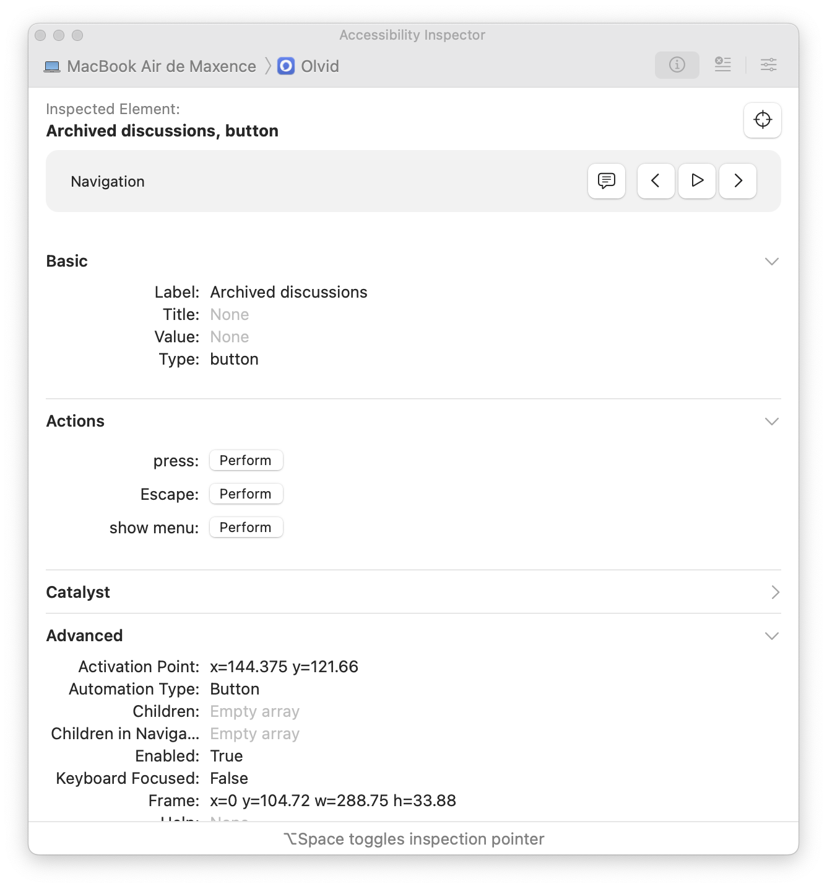

# 🍎 Inclusiveness features and programming for Apple platforms

!!! Info "In this module"
    This module introduces to Apple's accessibility features, and to the practice of programming accessibility for Apple platforms.

**⛳️ Section**: D. Programming inclusive and accessible software

**👥 Audience**: Apple developers and product teams

**⏱️ ️Duration**: 25'

**📚 Prerequisites**: [👩‍💻 Inclusive code 101](D-ICO.md)

---

## When to use

This module should be used with trainees who need or want to have a technical understanding how Apple's approach on accessibility. It can be useful for product managers or designers who want to understand Apple accessibility features, and what it takes to implement them (especially for the last sections).

## Introduction

For years, Apple has been setting the standard for mobile accessibility. Their design principles, guidelines, as well as the tools and technologies they built are among the best out there. They also provide extensive resources on how to use and apply them. Thanks to these, if you're developing natively for Apple platforms, implementing accessible interfaces will likely be easier than for other OSes.

Consequently, we won't be covering everything you should know about Apple accessibility in this module. Rather, we'll provide a very synthetic overview referencing useful official and third-party resources, along with some extra tips we wish we had when we started out.

## Apple's accessibility model

The model used by Apple to implement assistive technologies support to apps is based on accessibility attributes. It is quite close to Android and to the abstract model we detailed in [📱 Inclusive design for mobile](C-IDM.md), but we'll detail specific technical consideration and vocabulary here:

- An [**accessibility element**](https://developer.apple.com/documentation/swiftui/view-accessibility#Elements) is an element of the interface which will be accessed atomically (i.e. without dividing it into multiple elements) by cursor interfaces (like VoiceOver or Switch Control). Every element has accessibility attributes. Every UI Component provided by Apple is an accessibility element. You then have the choice to regroup them, either by completely resetting the element's attribute, or by automatically computing the children's one. In complex cases, we would recommend manually resetting computing those properties to get clean labels, actions etc.

- A [**label**](https://developer.apple.com/documentation/swiftui/view/accessibilitylabel(_:)-1d7jv) qualifies the name of an element. It is read by screen readers, and used in order to access the element with Voice Control. This is why it should always be as short as possible yet distinct from other elements of the interface. For complementary information on the element, the value should be used. For example, a button should have its title as label.

- A [**value**](https://developer.apple.com/documentation/swiftui/view/accessibilityvalue(_:)-z9mo) gives information about the element, like its state or any other information that is not in the label. It is typically read after the label by the screen reader. For example, for a toggle, the value would give its state (enabled or disabled).

- A [**trait**](https://developer.apple.com/documentation/swiftui/view/accessibilityaddtraits(_:)) qualifies an element on its type or role: it is mainly useful to the system, to know which information to read first, which levers or indications to expose to the user, etc. Multiple ones can (and likely should) be applied on one element. Depending on the components you are working with, some traits are applied automatically, and some others require to explicitly apply a modifier. There are many accessibility traits ([SwiftUI](https://developer.apple.com/documentation/swiftui/accessibilitytraits), [UIKit](https://developer.apple.com/documentation/uikit/uiaccessibilitytraits)), when beginning your accessibility journey, we recommend checking this list regularly when you add traits to your elements as it is a good way to try and understand them in context. For example, here are a few:
    - **[Button](https://developer.apple.com/documentation/swiftui/accessibilitytraits/isbutton):** the name speaks for itself!
    - **[Header](https://developer.apple.com/documentation/swiftui/accessibilitytraits/isheader):** this one is absolutely crucial as it allows users to quickly skip through the headings of the view.
    - **[Allows direct interaction](https://developer.apple.com/documentation/swiftui/accessibilitytraits/allowsdirectinteraction):** allows users to interact with the element through touch, bypassing VoiceOver. A typical usage example is for a piano app.

- An [**action**](https://developer.apple.com/documentation/swiftui/view-accessibility#Actions) is a function ```() -> Void``` that will be triggered by a double-tap in VoiceOver, or a tap with Switch Control. There is a default one, which is not named but called on the UI "Activate", and an arbitrary number of custom ones which are named and can be selected using swipes in VoiceOver, and a dedicated contextual menu in Switch Control. It is very useful and often crucial to provide many actions on an element. For example, for a discussion in a list, the default action would be to open it, and a custom one could be to mute it.

- A [**hint**](https://developer.apple.com/documentation/swiftui/view-accessibility#Hints) gives additional textual information or context to the user that will be read last. Hints should help users who have lost the context of where they are, or who don't understand how to interact with an element.

- A [**sort priority**](https://developer.apple.com/documentation/swiftui/view/accessibilitysortpriority(_:)) allows to implement a custom focus order. Elements can also be [programmatically focused](https://developer.apple.com/documentation/swiftui/view-accessibility#Focus), which is very useful as you often don't want to start by the first element in the focus order.

- [Custom content](https://developer.apple.com/documentation/swiftui/view/accessibilitycustomcontent(_:_:importance:)) gives the opportunity to convey information that you could not give through the other attributes.

- Custom [**gestures**](https://developer.apple.com/documentation/swiftui/view/accessibilitysortpriority(_:)) can also be implemented for advanced custom components that require touch customization.

## Apple's Assistive Technologies

Having an understanding of the assistive technologies for which you are building your app is necessary to delivering a great experience. Apple has a lot of them, which they list [on this page](https://developer.apple.com/accessibility/). Here is our non-exhaustive condensed introduction to Apple-specific Assistive technologies, along with some additional information and tips. Clicking on highlighted keywords will take you to documentation and useful resources.

### Major features

- [**VoiceOver**](https://developer.apple.com/documentation/accessibility/voiceover/) is Apple's screen reader. It allows users to access your app without seeing the screen. Like [TalkBack, Android's screen reader](https://www.youtube.com/watch?v=MEp9DtiTw3s), it is gesture-based, meaning that users can execute [simple to complex gestures](https://appt.org/en/docs/ios/features/voiceover) in order to control their device. Supporting [custom rotors actions](https://developer.apple.com/documentation/swiftui/view-accessibility#Working-with-rotors) is a great way to provide quick app-specific actions that go beyond the bare necessity. **Learning how to use VoiceOver is probably the best way to understand the levers you can activate to enhance the accessibility of your app**, as it is very intuitive, commonly used, and relies both on labels and group focus.

- [**Voice Control**](https://developer.apple.com/documentation/accessibility/voice-control) is a feature allowing users to interact with their devices using their voice. One takeaway of trying Voice Control is understanding how labels differ from values. In fact, labels are used by Voice Control users to select elements on the screen. We can therefore understand that labels should be short, unique identifiers reflecting what is shown on the screen. Values, on the other side, are only read by screen readers and can (and should) be more extensive.

- [**Switch Control**](https://developer.apple.com/documentation/accessibility/switch-control) lets users navigate your app with the switch devices of their choice, and/or mouth gestures. Having a clear and efficient navigation and grouping is crucial to making it accessible to users who rely on switch control. While Switch Control support typically comes for free when VoiceOver is, it's a great idea to think about the ways you can enhance its users' experience by [implementing simple custom behaviors allowing for smarter and faster interaction](https://developer.apple.com/videos/play/wwdc2020/10019/).

- [**Assistive access**](https://developer.apple.com/documentation/accessibility/assistive-access)'s goal is to provide a minimal experience for people with certain cognitive disabilities or who are less familiar with new technologies. With little effort, developers can allow everyone to use the basic features of their app. **[Guided access](https://developer.apple.com/videos/play/wwdc2022/10152/)** allows these users to get a guided experience with custom restrictions, allowing to disable keyboard inputs, volume buttons, *etc*. With the provided API, you can provide restrictions that are specific to your app. For example, you can disable the access to the settings. This feature can also be used to function like [Android's lock task mode](https://developer.android.com/work/dpc/dedicated-devices/lock-task-mode) (often called "kiosk mode") in business context.

### Minor features

- For vision-impaired users:
    - Apple provides a **Text to [Speech](https://developer.apple.com/documentation/accessibility/speech/)** API. While it is not always required for developers to use it as VoiceOver natively does the job, using it allows to programmatically announce events that are currently only conveyed visually, like a new message.
    - **[Dynamic Type](https://developer.apple.com/videos/play/wwdc2024/10074/)** is Apple's fancy name for their advanced system font settings, which allows developers to adapt their app's layout to varying font sizes.
    - **[Display customization settings](https://developer.apple.com/videos/play/wwdc2020/10020/)** like high contrast or reduced motion can be detected to adapt your app's behavior.
    - **[Magic tap](https://github.com/cvs-health/ios-swiftui-accessibility-techniques/blob/main/iOSswiftUIa11yTechniques/Documentation/MagicTap.md)** is a very useful feature that is rarely implemented in third-party apps. It allows to perform an arbitrary action upon a "magic tap" - a 2 fingers double tap with VoiceOver activated. If designed and hinted well, it can allow for quicker and easier interactions.
    - For apps serving audio and video content, builtin AVFoundation APIs [allows you to add **alternative audio tracks**](https://developer.apple.com/documentation/avfoundation/selecting-subtitles-and-alternative-audio-tracks.)

- For users with limited physical or motors abilities:
    - [**Keyboard support**](https://developer.apple.com/videos/play/wwdc2021/10120/) in iOS and iPadOS give developers the opportunity to provide users with shortcuts to navigate their app faster and easier.
    - [**Eye Tracking**](https://support.apple.com/en-gb/guide/iphone/iph66057d0f6/ios) allows users to control their iPhone through gaze. There is - to our knowledge - typically no additional considerations for this technology.
    - [**Quick actions**](https://developer.apple.com/documentation/swiftui/view/accessibilityquickaction(style:content:)/) can be implemented to allow users wearing an Apple Watch to trigger custom behaviors by pinching twice.

- For users who are deaf of hard of hearing:
    - For apps serving audio and video content, builtin AVFoundation APIs [allows you to add **subtitles**](https://developer.apple.com/documentation/avfoundation/selecting-subtitles-and-alternative-audio-tracks.).
    - Information conveyed through audio can also be played through [**haptics** which can even be customized](https://developer.apple.com/documentation/corehaptics/preparing_your_app_to_play_haptics/) to fit your needs. If your app plays music, **[Music Haptics](https://developer.apple.com/documentation/mediaaccessibility/music-haptics/)** allows users to enjoy music through haptic feedback.


## Accessibility in SwiftUI

### The ViewModifier approach

Accessibility in SwiftUI relies heavily on the use of accessibility modifiers, which [the list](https://developer.apple.com/documentation/swiftui/view-accessibility) can be very inspiring to come up with accessibility features. These are essentially [view modifiers](https://developer.apple.com/documentation/swiftui/viewmodifier) applying accessibility attributes or transformations. There are plenty of them, and we will not detail them here. Rather, we'll briefly discuss this approach and the issues you might run into using those.

#### Grouping elements

Something you will likely find yourself doing very regularly is grouping elements. As it is rather complicated to get started with, we will explain the basics. As said earlier, there are different ways of doing so, each corresponding to a case of the [```AccessibilityChildBehavior```](https://developer.apple.com/documentation/swiftui/accessibilitychildbehavior) enum:

```swift
var body: some View {
    Group {
        NiceView()
        VeryNiceView()
    }
    .accessibilityElement(children: <#T##AccessibilityChildBehavior#>)
}
```

##### .combine

**```.combine```** will create a new parent accessibility element, drop its children elements from the accessibility tree (```NiceView``` and ```VeryNiceView``` in our example), and compute new accessibility attributes based on the remove children's ones. As indicated in the documentation:

!!! Quote "[SwiftUI API Documentation](https://developer.apple.com/documentation/swiftui/accessibilitychildbehavior/combine)"
    Some properties may be transformed or ignored to achieve the ideal combined result.

*This is why we recommend avoiding this modifier in most cases. While being very convenient, its opaque heuristic makes your code unpredictable by the reader and will likely result in an "automatic" interface that will necessarily lead to a poor UX.*

##### .ignore

**```.ignore```** will also create a new accessibility element, also drop its children, but won't get any accessibility attribute for free - you have explicitly write them again.

***This is the way we would recommend to do it****, as it allows to implement thoughtful accessibility attributes.*

##### .contain

**```.contain```** does not compete with ```.combine``` and ```.ignore``` because it does not serve the same purpose. While it will create a new accessibility element in the tree, their children won't be dropped. As a result, this modifier is only useful to structure navigation and order elements, [making sure all the children of the newly created elements are navigated before going to the next accessibility element](https://developer.apple.com/documentation/swiftui/accessibilitychildbehavior/contain#discussion).

To get more insights on whether to group elements or not, refer to [🎨 Inclusive design 101](C-IDE.md).

#### Limits to this approach

If you follow the guidelines we provided above, your code might look like this:

```swift
var body: some View {
    Group {
        NiceView()
        VeryNiceView()
    }
    .accessibilityElement(children: .ignore)
    .accessibilityLabel(Text("VERY_NICE_LABEL"))
    .accessibilityHint(Text("VERY_NICE_HINT"))
    .accessibilityAddTraits(.isButton)
    .accessibilityAction(named: Text("VERY_NICE_ACTION")) {
        print("Action performed!")
    }

    SomeOtherView()
        .accessibilityLabel(Text("A11Y"))
        .accessibilityHint(Text("SOME_OTHER_HINT"))
        .accessibilitySortPriority(1)
}
```

There are several issues we can find in this implementation:

- The accessibility-related code is hard to find. In bigger and more complex views, it gets scattered all over the view's code.
- If same snippets are likely to be repeated everywhere.
- Yet, consistency across the codebase is not enforced, nor nudged.

### Building a custom accessibility architecture

To address those issues in the [Olvid](https://olvid.io) iOS app, the team worked on helpers that facilitate the work of making components and end-user views accessible.

!!! Info
    In this section, we will be using for example purposes some code extracts from [the Olvid iOS client](https://github.com/olvid-io/olvid-ios), which is licensed under the [GNU Affero General Public License v3](https://github.com/olvid-io/olvid-ios/blob/main/LICENSE).

The goals were to **facilitate, structure and harmonize** the way accessibility is implemented across the codebase. Based on our needs, here is what we ended up with:

- A protocol requiring to provide accessibility attributes.
- A struct giving those accessibility attributes.
- A view modifier that can be applied on any view conforming to the protocol, applying those accessibility attributes.

As a result, the code can look like:

```swift
private struct HorizontalListOfUsersViewCell: View {

    // [...]

    var body: some View {
            InternalView(user: user,
                         identifiersOfSelectedUsers: $identifiersOfSelectedUsers,
                         profilePicture: profilePicture?.image,
                         avatarSize: avatarSize)
            .obvAccessibleComponent() // The custom ViewModifier can be applied because the internal view conforms...

            // [...]

        }

    private struct InternalView: ObvAccessibilityProvidableView /* ...to this protocol... */ {

        // [...]

        var accessibilityAttributes: ObvAccessibility.ObvAccessibilityAttributes { // ...which requires to provide this struct.
            .init(
                label: user?.identityDetails.coreDetails.getDisplayNameWithStyle(.firstNameThenLastName) ?? " ",
                value: String(localizedInThisBundle: "SELECTED"),
                actions: [.default: buttonAction],
                hint: String(localizedInThisBundle: "DOUBLE_TAP_TO_REMOVE"),
                traits: [.isButton])
        }

        var body: some View {

            // [...]

        }

    }

}

```

Now, the accessibility information is easier to find, and the attributes can be applied by a single ViewModifier that encapsulates the grouping guidelines we provided earlier.

Please note this architecture is not to be seen as the perfect way to go. We simply hope it will inspire you to build your own!

## Accessibility in UIKit

We won't be covering accessibility in for UIKit in this module as we have very little experience dealing with it. From what we can tell, it is way less operational than SwiftUI at scale but can still help you make dramatic improvements on your app's accessibility. You can checkout this great resource for [UIKit accessibility code](https://appt.org/en/docs/ios/samples). Here is also [Apple's documentation.](https://developer.apple.com/documentation/uikit/accessibility-for-uikit)

!!! Tip "If you have the knowledge"
    We would be happy to integrate some of your knowledge on UIKit Accessibility to our project. Feel free to [contribute](https://github.com/alterity-git/building-inclusive-open-source-software)!

## Accessibility Inspector

This is a tool that allows you to inspect any accessibility element on your device, whether physical or emulated. It is very useful when developing to get a textual representation of your components' accessibility attributes. It can also perform accessibility audits that are fast but not very insightful.



[Here is a detailed video presenting the tool](https://developer.apple.com/videos/play/wwdc2019/257).

## Informing users on your app's accessibility

Once you've done all of this work, you probably want users who value accessibility to know that your app is worth downloading and testing. Apple recently added what they call the [Accessibility Nutrition Labels](https://developer.apple.com/help/app-store-connect/manage-app-accessibility/overview-of-accessibility-nutrition-labels/) which are essentially a way of telling users which accessibility features you implemented in your app.

It's also a good idea to indicate to which technologies or disabilities your app is not accessible. If your app is not ready for being accessible to VoiceOver users, being transparent about it will avoid users who rely on it to try your app and get frustrated.

## Wrapping up

- Apple provides **powerful tools** for you to achieve great accessibility in your apps.
- **Apple's accessibility model is based on elements and attributes**. Providing as many as relevant will help assistive technologies work well with your solution.
- **Knowing about the features used by your users is crucial** as it is the first step towards understanding their needs. Some features listed in the module can also be a source of inspiration for you to provide innovative and intuitive way of interacting with your app.
- SwiftUI accessibility leverages the flexibility of view modifiers, which is sometimes paid at the price of code readability and structure. Once you've identified patterns in the way you and your team use Apple accessibility's framework, **you can build helper functions that will facilitate, harmonize and structure accessibility across your codebase.**
- **Accessibility Nutrition Labels** allow developers to let the users know which accessibility features they can expect when downloading your app.

## Resources

[Accessibility | Apple Developer Documentation](https://developer.apple.com/documentation/accessibility/)

[iOS accessibility | Appt](https://appt.org/en/docs/ios)

[olvid-io/olvid-ios: Olvid client application for iOS](https://github.com/olvid-io/olvid-ios)