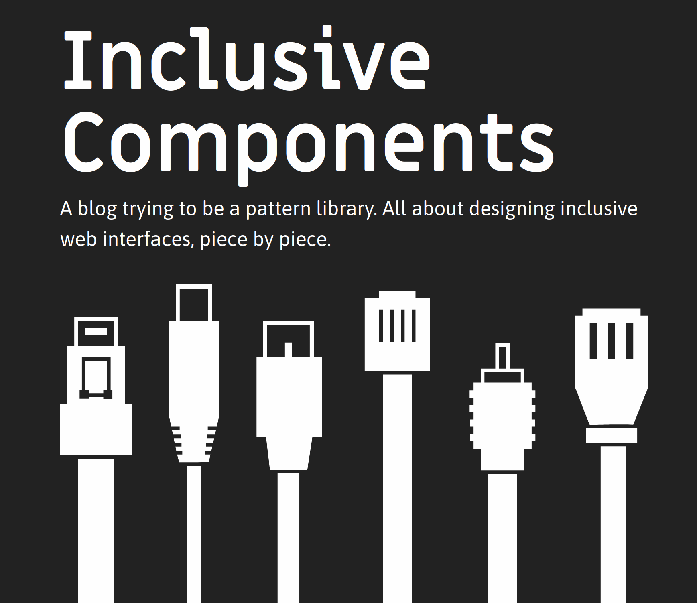
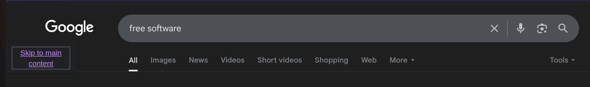
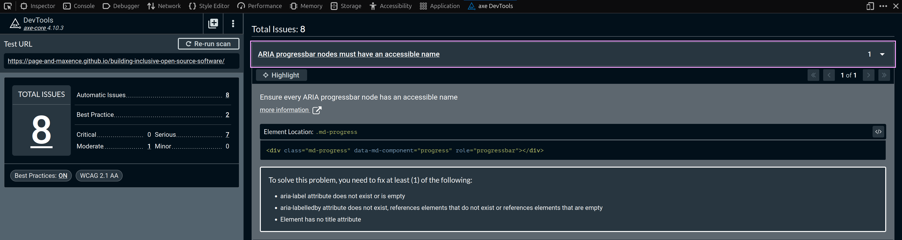

# 🕸️ Inclusive Web programming

!!! Info "In this module"
    This module provides basic information for starting to work on accessibility and inclusiveness for your website or webapp.
**⛳️ Section**: *D. Programming inclusive and accessible software*

**👥 Audience**: Developers

**⏱️ ️Duration**: 10'

**📚 Prerequisites**: [👩‍💻 Inclusive code 101](D-ICO.md)

---

## When to use?
Go through this module if you work in web front-end development or with a web-based framework. Please note that this module requires the trainees to follow [👩‍💻 Inclusive code 101](D-ICO.md) first.

## Disclaimer

We -the original authors- are not web developers ourselves. Providing web programming guidelines is not the main goal of this project, but we figured it could be helpful for some organizations (at least it was for ours). Additionally, as we mentioned earlier, there already exist plenty of great resources for web accessibility. Therefore, this section will mostly be a hall of very useful content we found on the topic. If you have experience with web accessibility, please feel free to [contribute](https://github.com/alterity-git/building-inclusive-open-source-software) to share your expertise!

## Useful references

We selected a few resources that are particularly useful to get started on web accessibility and inclusiveness.

### The WCAG guidelines

We mentioned the WCAG guidelines multiple times through the training. These are the international guidelines for web accessibility, and it should also be yours. We especially recommend using the [*How to Meet WCAG (Quick Reference)*](https://www.w3.org/WAI/WCAG22/quickref/) from the Web Accessibility Initiative.

### The *Inclusive Components project*

The [Inclusive Components blog and pattern library](https://inclusive-components.design/#components) should be one of your privileged resource going forward with web accessibility. It provides articles, documentation and code snippets for making elements such as collapsible sections, tooltips, toggle buttons, etc. inclusive. It's truly an enormous and immensely helpful work.

### Mozilla's accessibility documentation

When it comes to essentials of web development, Mozilla always has a resource. Accessibility is not an exception! [Their very extensive and beginner-friendly reference](https://developer.mozilla.org/en-US/docs/Web/Accessibility) is a great starting point.

### Keyboard usage

#### Navigation

Navigation inside a web page or a webapp is often not trivial to design. This [article](https://www.smashingmagazine.com/2022/11/guide-keyboard-accessibility-html-css-part1/) cover the basics of html and CSS accessible programming.

You can watch [this video](https://www.youtube.com/watch?v=yV_ENQZq3fs&t=418s) to get a sense of how to test your website with a screen reader and keyboard navigation.

#### Skip to content

Most websites should include a "Skip to main content". This allows users to navigate directly to the content of a page without going through all of the menus, situated at the top of almost every single page they navigate.

#### Heading hierarchy

This one is easy. When navigating a web page, screen readers and other assistive technologies will generate a table of content for the user using the headings.

!!! Tip
    **Therefore, breaking the hierarchy of headings, for example by skipping from a heading 2 to a heading 4 will probably break the navigation of your webpage for assistive technologies.**

#### Menus

Designing and implementing usable and accessible menus is a requirement to making great web interfaces. This [very extensive documentation](https://inclusive-components.design/menus-menu-buttons/) provides insightful guidelines and code snippets to implement your menus in an accessible way. You may also use [this article](https://www.smashingmagazine.com/2017/11/building-accessible-menu-systems/).

#### JavaScript

[*A Guide To Keyboard Accessibility: JavaScript*](https://www.smashingmagazine.com/2022/11/guide-keyboard-accessibility-javascript-part2/) is article that provides detailed insights and code snippets about accessibility programming using JavaScript.

### Testing tools

#### Wave

We already covered Wave in the [🔧 Assistive technologies : Desktop](A-ITD.md) module. [Wave](https://wave.webaim.org/) is a testing software built to automatically detect warnings and errors related to the [WCAG Accessibility guidelines](https://www.w3.org/WAI/standards-guidelines/wcag/). It’s as simple as entering your domain to see prevalent issues with your website.

!!! Tip
    We recommend using [**Wave's browser extension**](https://wave.webaim.org/extension/) that allows to run audits faster and locally, which is particularly useful for developing.

While you might be working on a native app, it’s very likely that you or your organization have a website along with it. Wave is a very convenient way of checking if you’re also up-to-date on that end without needing further knowledge.

Still be careful not to believe blindly the feedback form automated tools lke Wave. **It will often make mistakes** and is not a substitute to human expertise.

#### Lighthouse

[Lighthouse](https://learn.microsoft.com/en-us/microsoft-edge/devtools/lighthouse/lighthouse-tool?source=recommendations) is a web accessibility testing software developed by Microsoft and integrated in Microsoft Edge. It works quite similarly to wave. You can check [Microsoft's documentation](https://learn.microsoft.com/en-ca/microsoft-edge/devtools/accessibility/lighthouse) on how to use it.

#### Axe

[Axe](https://www.deque.com/axe/) is one of the most used web accessibility tool with over two billion downloads. It's developed and maintained by [Deque](https://www.deque.com/) which are behind the accessibility of some of the biggest companies worldwide. Its feedback is very comprehensible, providing insights on how to fix specific issues and even providing information about "Best Practices".

## (Re)sources

[W3C. *How to Meet WCAG (Quick Reference)*](https://www.w3.org/WAI/WCAG22/quickref/)

[inclusive-components.design. *Inclusive components project*](https://inclusive-components.design/#components)

[Cristian Díaz. *A Guide To Keyboard Accessibility: HTML And CSS (Part 1)*](https://www.smashingmagazine.com/2022/11/guide-keyboard-accessibility-html-css-part1/)

[ExpandTheRoom. *How to Check Web Accessibility with a Screen Reader and Keyboard*](https://www.youtube.com/watch?v=yV_ENQZq3fs&t=418s)

[Heydon Pickering. *Building Accessible Menu Systems*](https://www.smashingmagazine.com/2017/11/building-accessible-menu-systems/)

[inclusive-components.design. *Menus & Menu Buttons*](https://inclusive-components.design/menus-menu-buttons/)

[Cristian Díaz. *A Guide To Keyboard Accessibility: JavaScript (Part 2)*](https://www.smashingmagazine.com/2022/11/guide-keyboard-accessibility-javascript-part2/)

[W3C. *WCAG 2 Overview*](https://www.w3.org/WAI/standards-guidelines/wcag/)

[Microsoft. *Test accessibility using Lighthouse*](https://learn.microsoft.com/en-ca/microsoft-edge/devtools/accessibility/lighthouse)

[Wave](https://wave.webaim.org/)

[Lighthouse](https://learn.microsoft.com/en-us/microsoft-edge/devtools/lighthouse/lighthouse-tool?source=recommendations)

[Axe](https://www.deque.com/axe/)