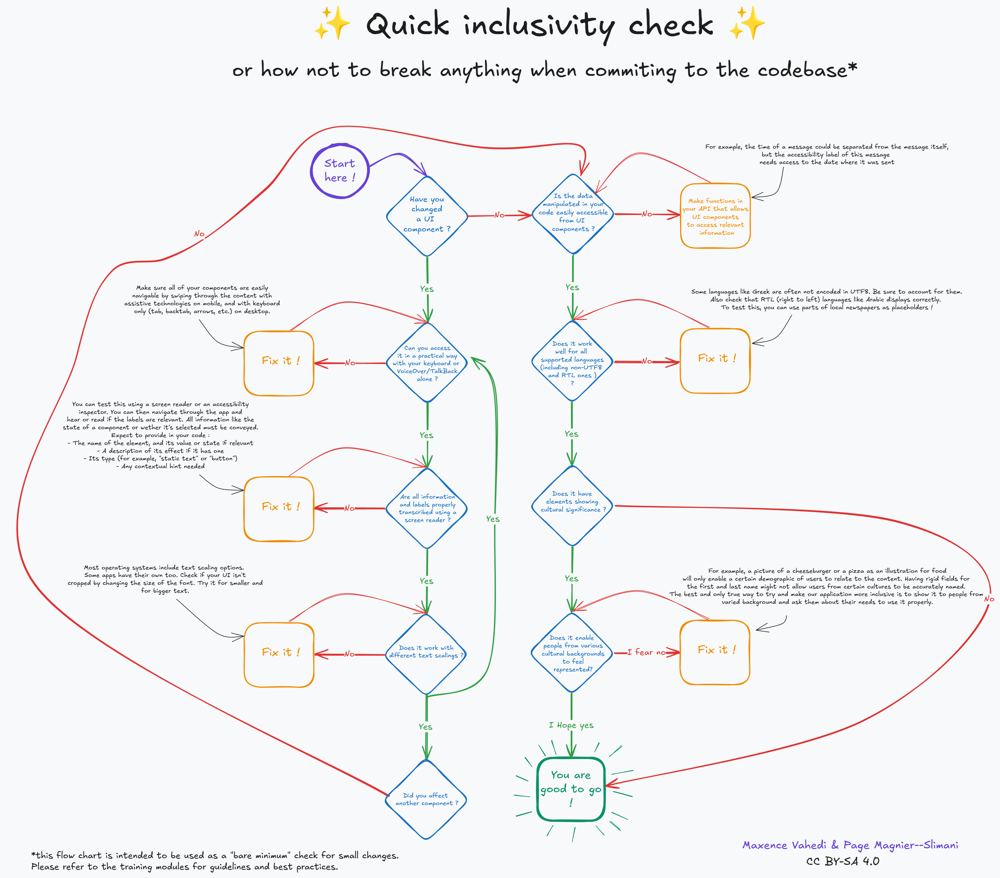

# 👩‍💻 E-ICO Inclusive code 101


    This module provides general information needed for building accessible code on
    any platform or language.

**⛳️ Section**: E. Programming inclusive and accessible software

**👥 Audience**: Developers

**⏱️ ️Duration**: 15'

**📚 Prerequisites**: [C-API We are all disabled and unique : accessibility, plurality and intersectionality](C-API.md)

---

# When to use ?

This module should be used with trainees before diving into the accessibility specificities of their platform, language or framework. It aims at settling good practices and avoiding common accessibility pitfalls.

# Description

## 1. Development mindset : Accessible code is good code

As we will see in this section, bad accessibility can often be a symptom of bad code. That’s good news ! It means that fixing it often only require good code practices.

---

### 1.A Custom components and accessibility

Many applicative frameworks come packed with standards components. Those can take many forms (labels, buttons, timers, abstract lists…). The main takeaway of this section, to put it simply would be :

>
⛔ STOP REINVENTING (or programming in our case) THE WHEEL (please)

>

You code can be good but will never be as robust as one iterated upon by a community of developers or a company. Therefore, before implementing anything, check rigorously that your framework or a library doesn’t provide a tool that would meet most of your needs.

Frameworks often have a unified and often automated way of handling accessibility with key navigation, focus and label generation. Therefore, building complex custom components will very frequently (not to say almost always) break accessibility handling. Therefore, try to limit the complexity of your UI objects, document them properly and when trying to fix an accessibility issue, consider taking the hard way by refactoring the component. Your whole code will actually be better.

For a more concrete example, on the left you can see a custom combo-box component, deeply broken from an accessibility standpoint. On the right, you can see a native Qt combo-box, more feature-full -aesthetics aside- and working fine with a screen reader and Keyboard navigation without necessitating any intervention.

<div style="display: flex; justify-content: space-between;">
    <div style="flex: 1; margin-right: 10px;">
        
    </div>
    <div style="flex: 1; margin-left: 10px;">
        
    </div>
</div>

We believe, there are only few reason not to use the second one.

---

### 1.B What bad accessibility says about our code: a few concrete example

Accessibility and inclusiveness in programming have one key benefit : making you think twice about your code. As said previously, stumbling into an accessibility issue might mean that you should be doing something in a different way.


Let’s investigate that by taking a look at the most obviously broken component in Jami : the username info box tooltip (the small i on the right)


It’s an “info box” (as called in the code), but a screen reader will handle it as a push button. That seems weird, as this is used as a tooltip, not a button accomplishing an action. Additionally, it doesn’t react well when selecting and unselecting the username text edit.

That is because in the code, this component is indeed a button. That goes without saying that it’s not a good way of implementing it and as a result the corresponding code is very extensive (more than 80 lines of code)! This is the cause of both the accessibility and the selection issue. While it technically works(barely) their are plenty of ways to use default components for a better result. In this case, broken accessibility indicate bad implementation choices.

```cpp
icon: PushButton {
    id: infoBox
    z: 1
    normalColor: "transparent"
    imageColor: infoBox.checked ? JamiTheme.inviteHoverColor : JamiTheme.buttonTintedBlue                        source: JamiResources.i_informations_black_24dp_svg
    pressedColor: JamiTheme.tintedBlue
    hoveredColor: JamiTheme.hoveredButtonColorWizard
    border.color: {
        if (infoBox.checked) {
            return "transparent";
        }
        return JamiTheme.buttonTintedBlue;
    }
    checkable: true
    onCheckedChanged: {
        textBoxinfo.visible = !textBoxinfo.visible;
    }
    preferredSize: 20
    ...
}
```

Another example would be the account selection list in Jami. It was not possible to navigate between the different items using the keyboard arrows making it non-usable from an accessibility standpoint.

<p align="center">
    
</p>

That’s an unexpected behavior as the best ListView Qt component (which our custom component is based on) support this behavior. A quick inspection of the code revealed those lines :

```cpp
Keys.onUpPressed: verticalScrollBar.decrease()
Keys.onDownPressed: verticalScrollBar.increase()
```

By reimplementing a scroll feature and binding it to the arrows key, we effectively broke the base behavior of the component. Here, broken accessibility showcase flawed design as the expected behavior of the component hasn’t been thought all the way through.

In this case, the fix was rather simple, use the base component rather the custom one.

### 1.C Focus and explicit key navigation, choose the right tool at the right time (desktop)

In order to implement alternative navigation in your app (keyboard, voice over, talkback, vocal command, etc), on desktop, they are two main way of doing it : focus and explicit key navigation. By default, your framework will try to predict the order in which you would want to move between objects by making all focusable elements accessible through alternative navigation. This will work mostly well on basic components.

It happens very often that this flow of navigation breaks for numerous reasons, a pop-up could have appeared, new UI elements might be visible or maybe the elements are complex (sub-tabs in settings for example)

As stated previously, all interactive components must be accessible :

If one is simply not reachable, your first strategy should be to try and make it focusable so that your framework can automatically incorporate it in its navigation.

Often, that might not be enough. The element could be reachable but not in any practical way. For example in a chat view, keyboard navigation could automatically send you to the first message loaded, forcing the user to pass through the whole conversation before accessing the message bar.

In those situations, you could want to use explicit keyboard navigation, to force a component to send you to another component that you has chosen. This is the most flexible but more time expensive approach. An example in pseudo code would be :

```cpp
KeyNavigation.tab: isTheExtendedViewLoaded() ? settingsButton : moreInfosButton
KeyNavigation.backtab: newAccountButton
KeyNavigation.up: isTheExtendedViewLoaded() ? fromBackupButton : alreadyHaveAccountButton
KeyNavigation.down: KeyNavigation.tab
```

---

## 2. Development pipeline

### 2.1 Accessibility workflows

Accessibility is a complex topic that can be hard to incorporate into routine development, especially with varying team composition and scale. Accessibility testing as done in more traditional industries would be difficult be set up. Therefore, we need to adapt existing accessibility guidelines to our workflow.

The most useful tip regarding this topic that we found in the [Agile Accessibility Handbook](https://accessibility.deque.com/agile-accessibility-handbook) would be the concept of accessibility coach. Each development team, should have someone especially knowledgeable and with a consequent empathy regarding accessibility. These coach will not be the one doing the core accessibility work and doesn’t need to be working full time on accessibility. They will rather **be the ones to monitor with other employees the progress of the current accessibility roadmap**. They are the one responsible to make sure that accessibility is a constant though at every step of development.

The coach of different teams can meet regularly to coordinate and update the accessibility roadmap of the application. They also can organize monthly meetings with the all of their teams to report on the improvements, blockers and perspectives. The main goal is to normalize accessibility and inclusiveness as routine parts of development.

We highly recommend creating a template of issues for accessibility and encouraging users and developers to fill them when encountering an issue. This would make it easier for developers to pic up an accessibility issue in the backlog and fix it.

If you want to learn further on this topic, the [Agile Accessibility Handbook](https://accessibility.deque.com/agile-accessibility-handbook) mentioned previously is a very solid starting point.

### 2.2 What can be automated?

What can be automated is a tricky question. As we stated previously, inclusiveness is a process and the need for an intersectional perspective make it impossible to think ahead every need that diverse user with complex background and set of ability might have.

**Therefore, no amount of checklists and tests in CI can replace feedback and testing from diverse user groups.**

That said, a few things can be set to try and automatically detect as much issue as possible. If your app is a web-view, this will be very easy and convenient. You can go to the [E-ETD Accessible technologies Desktop](E-ATD.md) module for more information.

If you app is native, you can set-up your CI to detect missing accessibility labels on focusable elements and setup a test that navigate through all od the elements of a view using the keyboard, checking that none of them wasn’t reached.

You can also use a template of a checklist containing the main elements to be sounded and share it with your team. We provide you, our own accessibility checklist template. Feel free to iterate upon it and to propose your enhancements in this repository.



**The diagram in text format:**

Did you change/create a UI component ?

- If no: skip to the question about data manipulation

Can you access it in a practical way with your keyboard or VoiceOver/TalkBack alone ?

- If no: Fix it ! All elements should be accessible without a mouse. Most users would expect the navigation to take place using TAB and BACKTAB.Arrows are also useful inside of lists. A top bar would typically be accessible with ALT. Shortcuts can make this navigation smoother

Are all information and labels properly transcribed using a screen reader ?

- If no: Fix it ! You can test this using your system screen reader on the settings or NVDA on Windows. You can then navigate through the app and hear if the labels are relevant. All information like the state of a component or wether it's selected must be transcribed. Expect to provide in your code:
    - A name for the element
    - A description of it's effect
    - it's role (for example static text or button)

Does it work with different text scaling ?

- If no: Fix it! Most operating systems have text scaling options.  Some apps have their own too. Check if your UI isn't cropped by changing the size of the font. Try it for smaller and for bigger text.

Did you affect another component ?

- If yes: repeat the previous questions for the other component

Is the data manipulated in your code easily accessible from UI components ?

- If no: Make functions in  your API that allow  UI components to access relevant information. For example, the time of a message is often in a separated component from the message itself but the accessibility label of this message could need access to the date where it was sent.

Does it work well for all languages ? (including non UTF8 and RTL ones )?

- If no: Fix it! Some languages like Greek are often not encoded in UTF8. Be sure to account for them. Also check that RTL (right to left) languages like Arabic displays correctly. To test this, you can use parts of local newspapers as placeholders !

Does it has elements showing cultural significance ?

- If no: You are good to go!
- If yes: Does it enable people from various cultural background to feel represented?

    - If you for no: Fix it! For example, a picture of a cheeseburger or a pizza as an illustration for food will only enable a certain demographic of users to feel represented. Having separate field for first and last name will not allow users from certain cultures to use the app properly. The only way to try and make our application more inclusive is to show it to people from varied background ans ask them about their needs to use it properly.

    - If you hope yes: You are good to go!

### 2.3 Accessible API’s & back-end

On the back-end too, accessible code is good code. A well-designed architecture or API will be more understandable for everyone to understand and iterate on, particularly for open source software.

Here are some key elements to making your API accessible:

- When choosing a name for some object, make sure to apply those principles:
    - Avoid abbreviations, which can be either difficult to understand to some people due to language, screen reader use, or cognitive disabilities.
    - Make sure the name is as clear and complete as possible.
- Regarding documentation and code commenting, remember to:
    - Write clear sentences with simple language that will enable everyone to understand the purpose of your code.
    - If your documentation is built to HTML, check with [the WAVE tool](https://wave.webaim.org/) that it is WCAG-compliant.

## 3. Conclusion

Accessible programming can be overwhelming, mostly due to the lack of resources for native apps, but with the right tools it’s absolutely bearable. Remember that accessibility issues in your code often hide underlying issues and to set up proper workflows and tests.

From here, you might want to take a look at some of our modules about inclusive programming for different platforms, ecosystems and frameworks.

# Resources

[QuickInclusivenessCheck.excalidraw](ressources/E-ProgrammingInclusiveAndAccessibleSoftware/QuickInclusivenessCheck.excalidraw)

[WAVE Accessibility tool](https://wave.webaim.org/)

# Sources

[Agile Accessibility Handbook](https://accessibility.deque.com/agile-accessibility-handbook)
